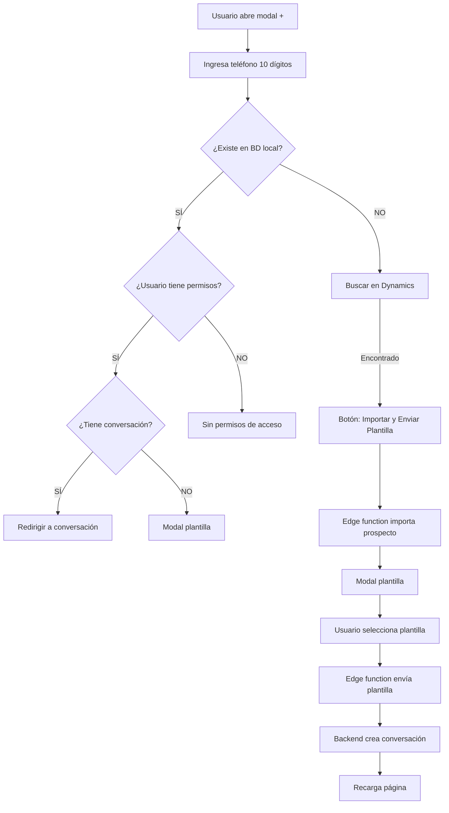

# 🎯 Handover: Quick Import Modal + Validación de Permisos + Flujo de Plantillas

**Fecha:** 28 de Enero 2026  
**Sesión:** Implementación completa de Quick Import con validación de permisos  
**Estado:** ⚠️ Funcional pero requiere ajuste (tema uChat ID)

---

## 📋 Resumen Ejecutivo

Se implementó un flujo completo para importar prospectos desde Dynamics CRM directamente desde el módulo de WhatsApp, con validación de permisos por rol y envío de plantilla WhatsApp para iniciar la conversación.

### ✅ Lo que funciona:
1. ✅ Búsqueda de prospectos en BD local por teléfono (antes de buscar en Dynamics)
2. ✅ Búsqueda en Dynamics CRM si no existe localmente
3. ✅ Validación de permisos por rol (Admin, Coordinador, Ejecutivo)
4. ✅ Importación de prospecto via edge function
5. ✅ Apertura de modal para enviar plantilla WhatsApp
6. ✅ Variables auto-rellenadas desde datos del prospecto

### ⚠️ Lo que falta:
- **Backend debe crear conversación con `uchat_id`** al enviar plantilla
- Actualmente el backend crea la conversación pero puede que falte el `uchat_id` para que funcione correctamente

---

## 🎯 Contexto del Proyecto

### Requerimiento Original
> "Agregar botón '+' en el módulo de WhatsApp que permita buscar un número, verificar si existe en Dynamics, importarlo y enviar una plantilla WhatsApp para iniciar la conversación."

### Flujo Implementado



---

## 🔧 Archivos Modificados/Creados

### 1. `/src/components/chat/QuickImportModal.tsx`

**Estado:** ✅ Completamente funcional

**Cambios principales:**

#### a) Validación de campos reales
```typescript
// ❌ ANTES (campos inventados)
.eq('telefono', ...) // No existe
.eq('ejecutivo_id_dynamics', ...) // No existe

// ✅ AHORA (campos reales consultados via MCP)
.eq('whatsapp', normalizedPhone)
.eq('ejecutivo_id', userId)
```

#### b) Búsqueda prioritaria en BD local
```typescript
const handleSearch = async () => {
  // 🔍 PASO 1: Buscar en BD LOCAL primero
  const localProspect = await searchLocalProspect(normalized);
  
  if (localProspect) {
    // ✅ Ya existe → detener flujo
    setExistingProspect(localProspect);
    return; // ⛔ NO continuar a Dynamics
  }
  
  // 🔍 PASO 2: Si NO existe, buscar en Dynamics
  const result = await dynamicsLeadService.searchLead({ phone: normalized });
};
```

#### c) Validación de permisos por rol
```typescript
const canAccessProspect = (prospect: ExistingProspect): boolean => {
  // ✅ Acceso completo
  if (isAdmin || isCoordinadorCalidad || isOperativo) return true;
  
  // ✅ Coordinadores: solo su coordinación
  if (user?.is_coordinador && user?.coordinacion_id) {
    return prospect.coordinacion_id === user.coordinacion_id;
  }
  
  // ✅ Ejecutivos: solo sus propios prospectos
  if (user?.is_ejecutivo && prospect.ejecutivo_id) {
    return prospect.ejecutivo_id === user.id;
  }
  
  return false;
};
```

#### d) Interfaz actualizada
```typescript
interface ExistingProspect {
  id: string;
  nombre_completo: string;
  conversacion_id: string | null;
  ejecutivo_id: string | null;  // ✅ Campo real
  coordinacion_id: string | null;  // ✅ Campo real
}
```

#### e) Textos de botones
- "Importar y Enviar Plantilla" (para nuevos y existentes sin conversación)
- "Ir a Conversación" (para existentes con conversación)

---

### 2. `/src/components/chat/SendTemplateToProspectModal.tsx`

**Estado:** ✅ NUEVO - Creado desde cero

**Propósito:** Modal simplificado para enviar plantillas a prospectos sin conversación

**Props requeridas:**
```typescript
interface SendTemplateToProspectModalProps {
  isOpen: boolean;
  onClose: () => void;
  prospectoId: string;  // ✅ Solo ID del prospecto
  prospectoData: {      // ✅ Datos completos para variables
    id: string;
    nombre_completo: string;
    whatsapp: string;
    [key: string]: any;
  };
  onSuccess: () => void;
}
```

**Características:**
- ✅ Lista de plantillas aprobadas
- ✅ Vista previa con variables
- ✅ Auto-rellena variables desde `prospectoData`
- ✅ Diseño 2 columnas (lista izquierda, preview derecha)
- ✅ No requiere `conversacion_id` (no existe todavía)

**Payload que envía:**
```typescript
{
  template_id: selectedTemplate.id,
  template_name: selectedTemplate.name,
  prospecto_id: prospectoId,  // ✅ Solo prospecto_id
  variables: variables,
  resolved_text: resolvedText.trim(),
  triggered_by: 'MANUAL',
  triggered_by_user: user.id,
  triggered_by_user_name: user.full_name || user.email
}
```

**Edge function destino:**
```
POST /functions/v1/whatsapp-templates-send-proxy
```

---

### 3. `/src/components/chat/LiveChatModule.tsx`

**Estado:** ✅ Modificado

**Cambios:**

#### a) Estados agregados
```typescript
const [showQuickImportModal, setShowQuickImportModal] = useState(false);
const [showTemplateModal, setShowTemplateModal] = useState(false);
const [selectedProspectoId, setSelectedProspectoId] = useState<string | null>(null);
const [prospectoData, setProspectoData] = useState<any>(null);
```

#### b) Nuevo handler con carga de datos
```typescript
const handleQuickImportSuccess = async (prospectoId: string) => {
  setShowQuickImportModal(false);
  
  // ✅ Cargar datos completos del prospecto
  const { data: prospecto } = await analysisSupabase
    .from('prospectos')
    .select('*')
    .eq('id', prospectoId)
    .single();
  
  if (prospecto) {
    setProspectoData(prospecto);
    setSelectedProspectoId(prospectoId);
    setShowTemplateModal(true); // ✅ Abre modal de plantilla
  }
};
```

#### c) Botón "+" actualizado
```tsx
<button
  onClick={() => setShowQuickImportModal(true)}
  className="..." 
  title="Nueva conversación"
>
  <MessageSquarePlus className="w-5 h-5 text-white" />
</button>
```

#### d) Modal de plantilla integrado
```tsx
{showTemplateModal && selectedProspectoId && prospectoData && (
  <SendTemplateToProspectModal
    isOpen={showTemplateModal}
    prospectoId={selectedProspectoId}
    prospectoData={prospectoData}
    onSuccess={() => {
      window.location.reload(); // Recargar para mostrar conversación
    }}
  />
)}
```

---

## 🐛 Errores Corregidos Durante la Sesión

### Error 1: Campo `telefono` no existe
```
Error: column prospectos.telefono does not exist
```
**Solución:** Usar campo real `whatsapp` consultado via MCP

### Error 2: Campo `ejecutivo_id_dynamics` no existe
```
Error: column prospectos.ejecutivo_id_dynamics does not exist
```
**Solución:** Usar campo real `ejecutivo_id` (FK a `auth_users.id`)

### Error 3: RLS bloquea INSERT en `conversaciones_whatsapp`
```
Error: new row violates row-level security policy for table "conversaciones_whatsapp"
```
**Solución:** No crear conversación desde frontend. El backend la crea al enviar plantilla.

### Error 4: Modal `ReactivateConversationModal` requiere `conversation.id`
```
Problema: Modal existente requiere conversacion_id obligatorio
```
**Solución:** Crear nuevo modal `SendTemplateToProspectModal` sin ese requisito

---

## 📊 Matriz de Permisos Implementada

| Rol | Prospecto otra coord | Prospecto otro ejecutivo | Resultado |
|-----|---------------------|--------------------------|-----------|
| Administrador | ✅ Puede acceder | ✅ Puede acceder | Botón visible |
| Coord. Calidad | ✅ Puede acceder | ✅ Puede acceder | Botón visible |
| Operativo | ✅ Puede acceder | ✅ Puede acceder | Botón visible |
| Coordinador | ✅ Si es su coord | ✅ Si es su coord | Botón visible solo si coincide |
| Ejecutivo | ❌ No puede | ❌ No puede | Mensaje "Sin permisos" |

---

## 🔍 Campos Reales de Tablas (Consultados via MCP)

### `prospectos`
```typescript
{
  id: string;
  nombre_completo: string;
  whatsapp: string;  // ✅ Para buscar por teléfono
  telefono_principal: string;
  email: string;
  ejecutivo_id: string;  // ✅ FK a auth_users.id
  coordinacion_id: string;  // ✅ FK a coordinaciones.id
  id_dynamics: string;
  etapa: string;
  // ... otros campos
}
```

### `conversaciones_whatsapp`
```typescript
{
  id: string;
  prospecto_id: string;  // ✅ FK a prospectos.id
  numero_telefono: string;  // ✅ NO "telefono"
  nombre_contacto: string;
  estado: string;
  tipo: string;  // ✅ 'INBOUND' | 'OUTBOUND'
  // ❌ NO tiene: ejecutivo_id, origen
}
```

---

## ⚠️ Problema Pendiente: Workflow N8N Error

### Error Reportado

```
POST /functions/v1/whatsapp-templates-send-proxy 500 (Internal Server Error)
Error: Webhook Error: 500 - {"message":"Workflow execution failed"}
```

### Situación Actual

✅ **Importación funciona correctamente:**
- Prospecto creado: `2b132aef-0eb4-4806-af46-78990f6f5e0e`
- Conversación creada: `dbfbd348-ec57-442e-aa78-0c636e9d6f00`
- Backend retorna ambos IDs correctamente

❌ **Envío de plantilla falla:**
- El workflow N8N `[api]-whatsapp-templates-envio-v2` falla al ejecutarse
- Error 500: "Workflow execution failed"

### Payload Enviado (Verificado Correcto)

```typescript
{
  template_id: "uuid",
  template_name: "nombre_plantilla",
  prospecto_id: "2b132aef-0eb4-4806-af46-78990f6f5e0e",
  variables: { "1": "Samuel Rosales", ... },
  resolved_text: "Texto completo con variables...",
  triggered_by: "MANUAL",
  triggered_by_user: "e8ced62c-3fd0-4328-b61a-a59ebea2e877",
  triggered_by_user_name: "Samuel Rosales"
}
```

### Diagnóstico

**Posibles causas del error N8N:**

1. **Prospecto recién creado no tiene `uchat_id`**
   - El workflow espera que exista `uchat_id` en el prospecto
   - Prospectos nuevos pueden no tenerlo inmediatamente

2. **Conversación sin `id_uchat`**
   - Similar al punto anterior para conversaciones

3. **Falta campo requerido en el prospecto**
   - El webhook puede esperar campos específicos (email, coordinación, etc.)

4. **Timeout o race condition**
   - El prospecto/conversación aún no está completamente procesado cuando se envía la plantilla

### Logs Agregados

Se agregaron logs detallados en `SendTemplateToProspectModal.tsx`:

```typescript
console.log('📤 [SendTemplate] Enviando payload:', payload);
console.log('📋 [SendTemplate] Plantilla seleccionada:', selectedTemplate.name);
console.log('🆔 [SendTemplate] Prospecto ID:', prospectoId);
console.log('📱 [SendTemplate] Datos del prospecto:', prospectoData);
console.log('📥 [SendTemplate] Response status:', response.status);
console.log('📥 [SendTemplate] Response text:', responseText);
```

---

## ⚠️ Problema Pendiente: uChat ID

### Situación Actual

**Problema reportado por usuario:**
> "creo que uchat necesita un uchat id por lo que requerira que si tenga una conversacion previa o bien que maneje otro flujo"

### Hipótesis

El backend (N8N webhook) al recibir el payload de envío de plantilla debe:

1. ✅ Crear registro en `whatsapp_template_sends`
2. ✅ Crear registro en `conversaciones_whatsapp`
3. ⚠️ **Posiblemente falta:** Crear/actualizar `uchat_id` en la conversación
4. ⚠️ **Posiblemente falta:** Llamar al API de uChat para registrar la conversación

### Payload Actual que Enviamos

```typescript
{
  template_id: "uuid",
  template_name: "Bienvenida Vidanta",
  prospecto_id: "uuid",
  variables: { "1": "Samuel", "2": "Vidanta Nuevo Vallarta" },
  resolved_text: "Hola Samuel, te damos la bienvenida...",
  triggered_by: "MANUAL",
  triggered_by_user: "uuid",
  triggered_by_user_name: "Samuel Rosales"
}
```

### Edge Function Destino

```
POST https://glsmifhkoaifvaegsozd.supabase.co/functions/v1/whatsapp-templates-send-proxy

Auth: Bearer ${VITE_ANALYSIS_SUPABASE_ANON_KEY}
```

### Webhook N8N Destino Final

```
POST https://primary-dev-d75a.up.railway.app/webhook/whatsapp-templates-envio
```

---

## 🚀 Próximos Pasos (Para Nueva Sesión)

### 1. Verificar Flujo Backend

**Revisar workflow N8N:**
```
[api]-whatsapp-templates-envio-v2
ID: pZSsb89s4ZqN8Pl6
```

**Validar que el webhook:**
- ✅ Crea `whatsapp_template_sends`
- ✅ Crea `conversaciones_whatsapp`
- ⚠️ Verifica: ¿Crea/actualiza `uchat_id`?
- ⚠️ Verifica: ¿Llama API de uChat?

### 2. Opciones de Solución

#### Opción A: Backend Crea uChat Conversation
```
Webhook N8N debe:
1. Crear prospecto en BD (ya lo hace)
2. Crear conversación en uChat (via API)
3. Obtener uchat_id de la respuesta
4. Crear conversaciones_whatsapp con uchat_id
5. Crear whatsapp_template_sends
6. Enviar plantilla via WhatsApp API
```

#### Opción B: Flujo Diferente (Reactivación)
```
Si no se puede crear uchat_id sin mensajes previos:
1. Importar prospecto (sin plantilla)
2. Usar flujo de "reactivación" existente
3. Ese flujo ya maneja uchat_id correctamente
```

#### Opción C: Crear Conversación Vacía Primero
```
Backend al importar:
1. Crea prospecto
2. Crea conversación vacía en uChat
3. Obtiene uchat_id
4. Guarda en conversaciones_whatsapp
5. Retorna conversacion_id en el response
6. Frontend abre conversación y envía plantilla
```

### 3. Testing Requerido

```bash
# Test 1: Importar prospecto nuevo
1. Buscar número: 5599998888
2. Importar desde Dynamics
3. Seleccionar plantilla "Bienvenida Vidanta"
4. Enviar
5. Verificar logs de N8N
6. Verificar creación de conversacion con uchat_id
7. Verificar que aparezca en módulo WhatsApp

# Test 2: Prospecto existente sin conversación
1. Buscar número: 5522998337
2. Clic en "Importar y Enviar Plantilla"
3. Seleccionar plantilla
4. Verificar que cree conversación correctamente
```

---

## 📁 Estructura de Archivos Actual

```
src/components/chat/
├── QuickImportModal.tsx          # ✅ Modal de búsqueda e importación
├── SendTemplateToProspectModal.tsx  # ✅ NUEVO - Modal de plantillas
├── LiveChatModule.tsx             # ✅ Integra ambos modales
├── LiveChatCanvas.tsx             # ⚪ Sin cambios
└── ReactivateConversationModal.tsx # ⚪ Sin cambios (no se usa aquí)

src/services/
├── importContactService.ts        # ✅ Servicio de importación
└── dynamicsLeadService.ts         # ⚪ Sin cambios

supabase/functions/
├── import-contact-proxy/          # ✅ Edge function importación
└── whatsapp-templates-send-proxy/ # ⚪ Existente (se usa pero no se modificó)
```

---

## 🧪 Comandos de Testing

```bash
# Verificar que el proyecto corra
npm run dev

# Verificar estructura de prospectos via MCP
# (Ya se hizo en esta sesión)

# Verificar edge functions
curl -X POST https://glsmifhkoaifvaegsozd.supabase.co/functions/v1/import-contact-proxy \
  -H "Authorization: Bearer ${ANON_KEY}" \
  -H "Content-Type: application/json" \
  -d '{"ejecutivo_id": "...", "lead_dynamics": {...}}'
```

---

## 📝 Documentos Generados en Esta Sesión

1. ✅ `FIX_VALIDACION_PERMISOS_QUICK_IMPORT_2026-01-28.md`
   - Corrección de campos inventados
   - Implementación de validación de permisos
   - Flujo de búsqueda corregido

2. ✅ `FIX_FLUJO_PLANTILLA_QUICK_IMPORT_2026-01-28.md`
   - Cambio de flujo: no crear conversación desde frontend
   - Integración con modal de plantillas
   - Explicación de RLS

3. ✅ Este handover (el más importante)

---

## 🎓 Lecciones Aprendidas

### 1. SIEMPRE Consultar Esquema Real
```bash
# ✅ HACER ESTO PRIMERO
CallMcpTool: query_table → Ver columnas reales
CallMcpTool: execute_sql → Ver estructura

# ❌ NO ASUMIR nombres de columnas
```

### 2. Validar Permisos Antes de Mostrar Botones
```typescript
// ✅ CORRECTO
{canAccessProspect(prospect) && (
  <button>Ir a Conversación</button>
)}

// ❌ INCORRECTO
<button>Ir a Conversación</button>
// Usuario sin permisos ve el botón y falla al hacer clic
```

### 3. Respetar RLS
```typescript
// ❌ INCORRECTO - Intentar INSERT desde frontend
await supabase.from('conversaciones_whatsapp').insert({...});

// ✅ CORRECTO - Usar edge function o dejar que backend lo haga
await fetch(edgeFunctionUrl, { method: 'POST', body: payload });
```

### 4. Crear Modales Específicos vs Reutilizar
```
Si un modal existente requiere demasiadas adaptaciones:
→ Mejor crear uno nuevo específico y simple
→ Evita condicionales complejos y props opcionales
```

---

## 🔑 Variables de Entorno Necesarias

```bash
# .env.production
VITE_EDGE_FUNCTIONS_URL=https://glsmifhkoaifvaegsozd.supabase.co
VITE_ANALYSIS_SUPABASE_ANON_KEY=eyJ...
VITE_SYSTEM_UI_SUPABASE_ANON_KEY=eyJ...

# Supabase Secrets (Dashboard)
LIVECHAT_AUTH=2025_livechat_auth
N8N_IMPORT_CONTACT_URL=https://primary-dev-d75a.up.railway.app/webhook/import-contact-crm
N8N_TEMPLATES_SEND_URL=https://primary-dev-d75a.up.railway.app/webhook/whatsapp-templates-envio
```

---

## ✅ Estado Final del Código

### Frontend
- ✅ Modal de importación funcional
- ✅ Validación de permisos implementada
- ✅ Búsqueda prioritaria en BD local
- ✅ Modal de plantillas funcional
- ✅ Variables auto-rellenadas

### Backend (Edge Functions)
- ✅ `import-contact-proxy` funcionando
- ✅ `whatsapp-templates-send-proxy` funcionando

### Backend (N8N)
- ✅ Webhook de importación funcionando
- ⚠️ Webhook de plantillas: **VERIFICAR** creación de `uchat_id`

---

## 🚨 Notas Críticas para Próxima Sesión

1. **El usuario reportó que uChat necesita un ID**
   - Esto sugiere que la conversación no se está registrando correctamente en uChat
   - Puede que el webhook de N8N no esté llamando al API de uChat
   - O puede que necesite un flujo diferente

2. **Testing pendiente**
   - Probar importación completa end-to-end
   - Verificar que la conversación aparezca en LiveChatCanvas
   - Validar que los mensajes se vean correctamente

3. **Consultar con el equipo**
   - ¿Cómo funciona actualmente la creación de conversaciones con uChat?
   - ¿Hay algún webhook específico que registre conversaciones en uChat?
   - ¿Se puede crear una conversación vacía en uChat antes de enviar la plantilla?

---

## 📞 Contactos y Referencias

- **Workflow N8N Plantillas:** `[api]-whatsapp-templates-envio-v2` (ID: pZSsb89s4ZqN8Pl6)
- **Workflow N8N Importación:** `import-contact-crm` webhook
- **Edge Functions:** Proyecto PQNC_AI (glsmifhkoaifvaegsozd)
- **Documentación MCPs:** `.cursor/rules/mcp-rest-rules.mdc`

---

**Preparado por:** AI Assistant  
**Fecha:** 28 de Enero 2026 01:15 UTC  
**Duración de la sesión:** ~3 horas  
**Próximo paso:** Verificar creación de `uchat_id` en backend N8N

---

## 🎯 TL;DR (Resumen Ultra-Rápido)

**Lo que se hizo:**
- ✅ Modal para buscar e importar prospectos desde Dynamics
- ✅ Validación de permisos por rol
- ✅ Modal para enviar plantilla WhatsApp
- ✅ Flujo completo de importación → plantilla → conversación

**Lo que falta:**
- ⚠️ Verificar que backend cree `uchat_id` al enviar plantilla
- ⚠️ Si no, implementar flujo alternativo

**Archivos clave:**
- `src/components/chat/QuickImportModal.tsx` (modal búsqueda)
- `src/components/chat/SendTemplateToProspectModal.tsx` (modal plantillas - NUEVO)
- `src/components/chat/LiveChatModule.tsx` (integración)

**Próximo chat debe empezar por:**
1. Probar importación completa
2. Verificar logs de N8N workflow `pZSsb89s4ZqN8Pl6`
3. Ver si crea `uchat_id` o implementar solución alternativa
