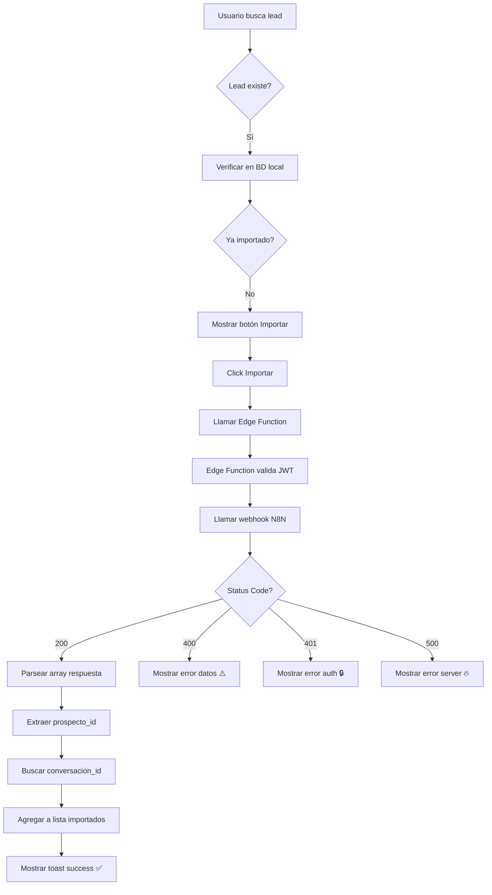

# Actualización: Manejo de Respuesta de Webhook Import Contact

**Fecha:** 2026-01-27 
**Tipo:** Ajuste de estructura de respuesta

---

## 🎯 Cambio Realizado

Se actualizó el servicio de importación para manejar correctamente la respuesta del webhook, que viene en **formato array** en lugar de objeto directo.

---

## 📋 Estructura de Respuesta

### ❌ Antes (Asumido)
```json
{
  "success": true,
  "prospecto_id": "...",
  "conversacion_id": "..."
}
```

### ✅ Ahora (Real)
```json
[
  {
    "success": true,
    "prospecto_id": "91e5397c-cc9f-4416-a423-41e0f4835202",
    "es_nuevo": true,
    "message": "Prospecto importado correctamente",
    "data": {
      "id": "91e5397c-cc9f-4416-a423-41e0f4835202",
      "nombre_completo": "MARIA GONGAL",
      "etapa": "importado manual",
      "origen": "IMPORTADO_MANUAL",
      "ejecutivo_id": "7ac0ed39-77e8-4564-acdd-3c1117ca584a",
      "ejecutivo_nombre": "Lopez Toscano Rolando",
      "coordinacion_id": "4c1ece41-bb6b-49a1-b52b-f5236f54d60a"
    }
  }
]
```

---

## 📝 Cambios en el Código

### 1. Servicio (`importContactService.ts`)

#### Nueva Interface

```typescript
export interface WebhookImportResponse {
  success: boolean;
  prospecto_id: string;
  es_nuevo: boolean;
  message: string;
  data: {
    id: string;
    nombre_completo: string;
    etapa: string;
    origen: string;
    ejecutivo_id: string;
    ejecutivo_nombre: string;
    coordinacion_id: string;
  };
}
```

#### Parseo de Respuesta

```typescript
// Parsear respuesta (viene en array)
const result: WebhookImportResponse[] = await response.json();

// Verificar que la respuesta sea un array
if (!Array.isArray(result) || result.length === 0) {
  return {
    success: false,
    message: 'Respuesta inválida del servidor',
    error: 'Formato de respuesta inesperado',
    statusCode: 500
  };
}

const firstResult = result[0];
```

#### Manejo de Códigos HTTP

```typescript
// 200: Exitoso
// 400: Datos inválidos
// 401: Error de autenticación
// 500: Error interno del servidor

switch (statusCode) {
  case 401:
    return {
      success: false,
      message: 'Error de autenticación',
      error: 'Token de autenticación inválido o expirado',
      statusCode: 401
    };
  case 500:
    return {
      success: false,
      message: 'Error interno del servidor',
      error: 'Error al procesar la importación en el servidor',
      statusCode: 500
    };
  case 400:
    return {
      success: false,
      message: 'Datos inválidos',
      error: errorText || 'Payload inválido o datos incompletos',
      statusCode: 400
    };
}
```

#### Búsqueda de Conversación

```typescript
// Buscar la conversación asociada al prospecto
// El webhook crea la conversación automáticamente
const { data: conversacion } = await analysisSupabase
  .from('conversaciones_whatsapp')
  .select('id')
  .eq('prospecto_id', firstResult.prospecto_id)
  .maybeSingle();

return {
  success: true,
  message: firstResult.message || 'Prospecto importado correctamente',
  prospecto_id: firstResult.prospecto_id,
  conversacion_id: conversacion?.id || '',
  statusCode: 200
};
```

### 2. Componente (`ManualImportTab.tsx`)

#### Mensajes de Error Personalizados

```typescript
if (result.success && result.prospecto_id) {
  // Éxito
  toast.success(result.message || 'Usuario importado exitosamente', {
    duration: 4000,
    icon: '✅'
  });
} else {
  // Error personalizado según código
  let errorMessage = result.message || 'Error al importar el contacto';
  let errorIcon = '❌';
  
  switch (result.statusCode) {
    case 400:
      errorIcon = '⚠️';
      errorMessage = `${errorMessage}\n${result.error || 'Datos inválidos'}`;
      break;
    case 401:
      errorIcon = '🔒';
      errorMessage = 'Error de autenticación. Recarga la página.';
      break;
    case 500:
      errorIcon = '🔥';
      errorMessage = 'Error del servidor. Intenta de nuevo.';
      break;
  }
  
  toast.error(errorMessage, {
    duration: 5000,
    icon: errorIcon
  });
}
```

#### Manejo de `conversacion_id` Opcional

```typescript
const newImported: ImportedProspect = {
  id: result.prospecto_id,
  nombre_completo: leadData.Nombre,
  telefono: normalizePhone(phoneNumber),
  conversacion_id: result.conversacion_id || '', // ⬅️ Manejo de caso sin conversación
  fecha_importacion: new Date().toISOString()
};
```

---

## 📊 Códigos de Estado

| Código | Icono | Mensaje | Acción Recomendada |
|--------|-------|---------|-------------------|
| `200` | ✅ | "Prospecto importado correctamente" | Agregar a lista, navegar a conversación |
| `400` | ⚠️ | "Datos inválidos o incompletos" | Validar payload, revisar campos requeridos |
| `401` | 🔒 | "Error de autenticación" | Recargar página, verificar JWT |
| `500` | 🔥 | "Error interno del servidor" | Reintentar después, contactar soporte |

---

## 🔄 Flujo Completo



---

## ✅ Validaciones Implementadas

1. ✅ Verificar que la respuesta sea un array
2. ✅ Verificar que tenga al menos un elemento
3. ✅ Verificar `firstResult.success === true`
4. ✅ Manejar códigos HTTP 400, 401, 500
5. ✅ Buscar conversación asociada en BD
6. ✅ Manejo de conversación no encontrada (string vacío)
7. ✅ Mensajes de error personalizados con iconos
8. ✅ Duración de toasts según tipo (4s éxito, 5s error)

---

## 📄 Documentación Generada

- ✅ `docs/WEBHOOK_IMPORT_RESPONSE_STRUCTURE.md` - Estructura completa de respuesta
- ✅ Interfaces TypeScript actualizadas
- ✅ Ejemplos de uso en servicio y componente
- ✅ Códigos de estado documentados

---

## 🧪 Casos de Prueba

### Caso 1: Importación Exitosa
```json
HTTP 200
[{
  "success": true,
  "prospecto_id": "uuid",
  "es_nuevo": true,
  "message": "Prospecto importado correctamente"
}]
```
**Resultado:** ✅ Toast éxito, agregar a lista, buscar conversación

### Caso 2: Datos Inválidos
```json
HTTP 400
{
  "error": "Missing ejecutivo_id",
  "message": "Datos incompletos"
}
```
**Resultado:** ⚠️ Toast error con mensaje específico

### Caso 3: Token Expirado
```json
HTTP 401
{
  "error": "Invalid token",
  "message": "Error de autenticación"
}
```
**Resultado:** 🔒 Toast error, sugerencia de recargar

### Caso 4: Error del Servidor
```json
HTTP 500
{
  "error": "Database connection failed",
  "message": "Error interno"
}
```
**Resultado:** 🔥 Toast error, sugerencia de reintentar

---

## 🔗 Archivos Modificados

1. `src/services/importContactService.ts`
   - Nueva interface `WebhookImportResponse`
   - Parseo de respuesta en array
   - Manejo de códigos HTTP
   - Búsqueda de conversación
   
2. `src/components/prospectos/ManualImportTab.tsx`
   - Mensajes de error personalizados
   - Iconos según tipo de error
   - Manejo de `conversacion_id` opcional

3. `docs/WEBHOOK_IMPORT_RESPONSE_STRUCTURE.md` (NUEVO)
   - Documentación completa de respuesta
   - Ejemplos reales
   - Flujo de manejo

---

## ✨ Mejoras Implementadas

- ✅ **Parseo robusto** de respuesta en array
- ✅ **Validación exhaustiva** de formato
- ✅ **Mensajes claros** según código HTTP
- ✅ **UX mejorada** con iconos y duraciones
- ✅ **Documentación completa** para referencia
- ✅ **Manejo de edge cases** (sin conversación, array vacío)

---

**Status:** ✅ Completado 
**Testing:** Pendiente de prueba con payload real 
**Última actualización:** 2026-01-27
