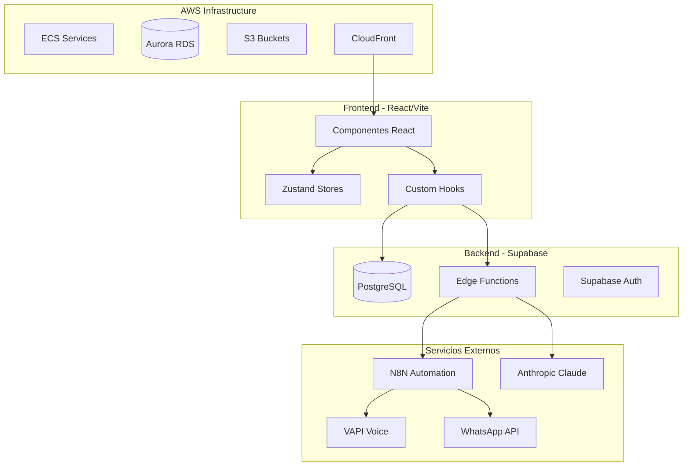

# Arquitectura - PQNC QA AI Platform

> Resumen ejecutivo de la arquitectura del sistema.
> Para detalles completos, ver `docs/` o `.cursor/rules/`.

---

## Stack Tecnológico

| Capa | Tecnología |
|------|------------|
| Frontend | React 19, TypeScript, Vite, TailwindCSS |
| Estado | Zustand, React Context |
| Backend | Supabase (PostgreSQL + Edge Functions) |
| AI | Anthropic Claude, OpenAI, VAPI |
| Mensajería | WhatsApp Business API via N8N |
| Infra | AWS (ECS, RDS, S3, CloudFront) |

---

## Diagrama de Arquitectura



---

## Estructura de Carpetas

```
src/
├── components/     # UI por módulo
│   ├── analysis/   # Análisis de llamadas
│   ├── chat/       # WhatsApp Live Chat
│   ├── prospectos/ # Gestión prospectos
│   ├── admin/      # Administración
│   └── shared/     # Componentes comunes
├── services/       # Lógica de negocio
├── hooks/          # Custom hooks
├── stores/         # Estado global (Zustand)
├── config/         # Configuración Supabase
├── contexts/       # React Context (Auth)
└── utils/          # Utilidades
```

---

## Base de Datos

**Proyecto:** PQNC_AI (`glsmifhkoaifvaegsozd.supabase.co`)

### Dominios Principales:

| Dominio | Tablas Clave |
|---------|--------------|
| Auth | `auth_users`, `auth_sessions`, `auth_roles` |
| Prospectos | `prospectos`, `prospect_assignments` |
| Llamadas | `llamadas_ventas`, `call_analysis_summary` |
| WhatsApp | `conversaciones_whatsapp`, `mensajes_whatsapp` |
| Config | `system_config`, `api_auth_tokens` |

---

## Flujos Principales

### 1. Autenticación

```
Login → AuthContext → Supabase Auth → Session → Permisos
```

### 2. Análisis de Llamadas

```
VAPI → N8N Webhook → Supabase → Live Monitor → Dashboard
```

### 3. WhatsApp

```
WhatsApp API → N8N → Supabase → Live Chat UI → Respuesta
```

---

## Integraciones

| Servicio | Uso | Configuración |
|----------|-----|---------------|
| N8N | Automatización | `credentialsService.getN8NCredentials()` |
| VAPI | Llamadas de voz | `vapiService` |
| Claude | Análisis IA | Edge Function `anthropic-proxy` |
| WhatsApp | Mensajería | N8N + Edge Functions |

---

## Seguridad

- **RLS habilitado** en todas las tablas
- **Solo `anon_key`** en frontend
- **Edge Functions** para operaciones privilegiadas
- **Clientes Admin eliminados** del codebase

---

## Referencias

- Reglas detalladas: `.cursor/rules/`
- Documentación: `docs/`
- Índice del código: `.cursor/CODEBASE_INDEX.md`
