# 🔧 ARQUITECTURA TÉCNICA DETALLADA - VIDANTA AI SYSTEM

```mermaid
graph TB
    subgraph "🌍 GLOBAL DNS LAYER"
        DNS[🌍 Route 53 DNS<br/>ai.vidanta.com<br/>Health Checks]
        HC1[🩺 Health Check AWS]
        HC2[🩺 Health Check GCP]
    end

    subgraph "☁️ AWS us-west-2 (PRIMARY)"
        subgraph "🌐 Public Subnets (DMZ)"
            ALB[⚖️ Application Load Balancer<br/>Internet-facing<br/>SSL Termination]
            NAT[🔄 NAT Gateway<br/>Outbound Internet]
        end

        subgraph "🔒 Private Subnets (Apps)"
            subgraph "🐳 ECS Fargate Cluster"
                N8N1[🔄 n8n Instance 1<br/>4 vCPU, 8GB RAM<br/>us-west-2a]
                N8N2[🔄 n8n Instance 2<br/>4 vCPU, 8GB RAM<br/>us-west-2b]
                N8NW1[👷 n8n Worker 1<br/>Queue Processing<br/>us-west-2a]
                N8NW2[👷 n8n Worker 2<br/>Queue Processing<br/>us-west-2b]
                FRONTEND[🖥️ Admin Frontend<br/>React App<br/>2 vCPU, 4GB RAM]
            end
        end

        subgraph "🗄️ Database Subnets"
            RDS[🗄️ RDS PostgreSQL<br/>db.r6g.large<br/>Multi-AZ<br/>100GB GP3 Encrypted]
            REDIS[🔴 ElastiCache Redis<br/>cache.r6g.large<br/>2 Nodes Cluster<br/>Multi-AZ Failover]
        end

        subgraph "📦 Storage Layer"
            S3MAIN[🪣 S3 Primary<br/>Recordings & Assets]
            S3BACKUP[🪣 S3 Backup<br/>Cross-Region Replication]
        end

        subgraph "🔐 Security & Networking"
            VPC[🌐 VPC 10.0.0.0/16]
            SG1[🔒 n8n Security Group<br/>Port 5678<br/>VAPI IPs Allowed]
            SG2[🔒 RDS Security Group<br/>Port 5432<br/>VPC Internal Only]
            SG3[🔒 Redis Security Group<br/>Port 6379<br/>VPC Internal Only]
        end

        subgraph "📊 Monitoring"
            CW[📊 CloudWatch<br/>Metrics & Logs]
            XRAY[🔍 X-Ray Tracing]
            SNS[📧 SNS Alerts]
        end
    end

    subgraph "☁️ GOOGLE CLOUD (SECONDARY FAILOVER)"
        subgraph "🌐 Global Load Balancer"
            GLB[⚖️ Global LB<br/>Anycast IP<br/>SSL Proxy]
        end

        subgraph "🐳 GKE Cluster"
            GKE[🐳 GKE Autopilot<br/>us-central1]
            N8NGCP1[🔄 n8n Pod 1<br/>4 vCPU, 8GB]
            N8NGCP2[🔄 n8n Pod 2<br/>4 vCPU, 8GB]
        end

        subgraph "🗄️ Data Layer GCP"
            CLOUDSQL[🗄️ Cloud SQL PostgreSQL<br/>db-custom-4-16384<br/>Regional HA]
            MEMSTORE[🔴 Memorystore Redis<br/>Standard Tier<br/>5GB Memory]
        end

        subgraph "📦 Storage GCP"
            GCS[🪣 Cloud Storage<br/>Multi-Regional<br/>Backup & DR]
        end
    end

    subgraph "🤖 VAPI INTEGRATION (Oregon)"
        VAPI1[📞 VAPI Server 1<br/>44.229.228.186<br/>us-west-2 EC2]
        VAPI2[📞 VAPI Server 2<br/>44.238.177.138<br/>us-west-2 EC2]
        VAPITOOLS[🛠️ Tools API<br/>Webhooks & Callbacks]
    end

    subgraph "📱 WhatsApp Integration"
        WHATSAPP[📱 WhatsApp Business API<br/>Meta Platform]
        WHATSAI[🤖 WhatsApp AI Bot<br/>Discovery & Routing]
    end

    subgraph "📞 TELECOM INFRASTRUCTURE"
        SIPTRUNK[📡 SIP Trunk Provider<br/>PSTN Gateway]
        CISCO[🏢 Cisco Call Manager<br/>On-Premise PBX<br/>IP Phones & Agents]
        PSTN[☎️ PSTN Network<br/>Traditional Telephony]
    end

    subgraph "📊 ANALYTICS & BI"
        DATAWAREHOUSE[🏬 Data Warehouse<br/>Analytics & Reports]
        POWERBI[📊 Power BI<br/>Executive Dashboards]
        REALTIME[⚡ Real-time Analytics<br/>Call Monitoring]
    end

    %% DNS Routing
    DNS --> HC1
    DNS --> HC2
    HC1 --> ALB
    HC2 -.-> GLB

    %% AWS Primary Flow
    ALB --> N8N1
    ALB --> N8N2
    N8N1 --> RDS
    N8N2 --> RDS
    N8N1 --> REDIS
    N8N2 --> REDIS
    N8NW1 --> REDIS
    N8NW2 --> REDIS
    
    %% VAPI Integration
    N8N1 <--> VAPI1
    N8N2 <--> VAPI2
    VAPI1 --> VAPITOOLS
    VAPI2 --> VAPITOOLS
    VAPITOOLS --> N8N1
    VAPITOOLS --> N8N2

    %% WhatsApp Flow
    WHATSAPP --> WHATSAI
    WHATSAI --> N8N1
    WHATSAI --> N8N2

    %% Telecom Integration
    VAPI1 --> SIPTRUNK
    VAPI2 --> SIPTRUNK
    SIPTRUNK --> CISCO
    CISCO --> PSTN

    %% GCP Failover (Dotted lines)
    GLB -.-> GKE
    N8NGCP1 -.-> CLOUDSQL
    N8NGCP2 -.-> CLOUDSQL
    N8NGCP1 -.-> MEMSTORE
    N8NGCP2 -.-> MEMSTORE

    %% Data Replication
    RDS -.-> CLOUDSQL
    REDIS -.-> MEMSTORE
    S3MAIN --> S3BACKUP
    S3BACKUP -.-> GCS

    %% Monitoring
    N8N1 --> CW
    N8N2 --> CW
    RDS --> CW
    REDIS --> CW
    CW --> SNS

    %% Analytics
    RDS --> DATAWAREHOUSE
    DATAWAREHOUSE --> POWERBI
    VAPI1 --> REALTIME
    VAPI2 --> REALTIME

    %% Network Security
    VPC --> SG1
    VPC --> SG2
    VPC --> SG3
    SG1 --> N8N1
    SG1 --> N8N2
    SG2 --> RDS
    SG3 --> REDIS

    %% Styling
    classDef aws fill:#FF9900,stroke:#232F3E,stroke-width:2px,color:#fff
    classDef gcp fill:#4285F4,stroke:#1a73e8,stroke-width:2px,color:#fff
    classDef vapi fill:#00D2FF,stroke:#0099CC,stroke-width:2px,color:#fff
    classDef whatsapp fill:#25D366,stroke:#128C7E,stroke-width:2px,color:#fff
    classDef telecom fill:#9C27B0,stroke:#6A1B9A,stroke-width:2px,color:#fff
    classDef analytics fill:#FFC107,stroke:#F57C00,stroke-width:2px,color:#000
    classDef security fill:#F44336,stroke:#C62828,stroke-width:2px,color:#fff

    class DNS,ALB,NAT,N8N1,N8N2,N8NW1,N8NW2,FRONTEND,RDS,REDIS,S3MAIN,S3BACKUP,VPC,CW,XRAY,SNS aws
    class GLB,GKE,N8NGCP1,N8NGCP2,CLOUDSQL,MEMSTORE,GCS gcp
    class VAPI1,VAPI2,VAPITOOLS vapi
    class WHATSAPP,WHATSAI whatsapp
    class SIPTRUNK,CISCO,PSTN telecom
    class DATAWAREHOUSE,POWERBI,REALTIME analytics
    class SG1,SG2,SG3 security
```



## 🔧 ESPECIFICACIONES TÉCNICAS DETALLADAS

### 🌍 **DNS & Traffic Management**
```yaml
Route 53 Configuration:
  Primary Record: A record → AWS ALB (us-west-2)
  Secondary Record: A record → GCP GLB (us-central1)
  Health Checks:
    - AWS: HTTPS /healthz every 30s
    - GCP: HTTPS /healthz every 30s
  Failover: Automatic < 90 seconds
  TTL: 60 seconds for fast failover
```

### ☁️ **AWS Infrastructure Specs**
```yaml
VPC Configuration:
  CIDR: 10.0.0.0/16
  Availability Zones: us-west-2a, us-west-2b
  Public Subnets: 10.0.1.0/24, 10.0.2.0/24
  Private Subnets: 10.0.10.0/24, 10.0.20.0/24
  Database Subnets: 10.0.100.0/24, 10.0.101.0/24

ECS Fargate Configuration:
  n8n Main:
    - CPU: 4096 (4 vCPU)
    - Memory: 8192 MB (8 GB)
    - Instances: 2-10 (Auto Scaling)
    - Health Check: /healthz endpoint
  
  n8n Workers:
    - CPU: 2048 (2 vCPU) 
    - Memory: 4096 MB (4 GB)
    - Instances: 2-20 (Queue based scaling)
    - Queue: Redis Bull Queue

RDS PostgreSQL:
  Instance: db.r6g.large
  CPU: 2 vCPU
  Memory: 16 GB
  Storage: 100 GB GP3 (3000 IOPS)
  Multi-AZ: Yes
  Backup: 7 days retention
  Encryption: AES-256

ElastiCache Redis:
  Instance: cache.r6g.large
  Memory: 13.07 GB per node
  Nodes: 2 (Primary + Replica)
  Multi-AZ: Yes
  Backup: 5 snapshots
  Encryption: In-transit & At-rest
```

### 🔐 **Security Configuration**
```yaml
Security Groups:
  n8n-app-sg:
    Inbound:
      - Port 5678 from ALB
      - Port 5678 from 44.229.228.186/32 (VAPI)
      - Port 5678 from 44.238.177.138/32 (VAPI)
    Outbound: All traffic
  
  rds-sg:
    Inbound:
      - Port 5432 from n8n-app-sg
    Outbound: None
  
  redis-sg:
    Inbound:
      - Port 6379 from n8n-app-sg
    Outbound: None

WAF Rules:
  - Rate limiting: 2000 requests/5min per IP
  - Geographic restrictions: Allow all
  - SQL injection protection: Enabled
  - XSS protection: Enabled
```

### 🤖 **VAPI Integration Details**
```yaml
VAPI Endpoints:
  Primary: 44.229.228.186:443
  Secondary: 44.238.177.138:443
  Protocol: HTTPS/WebSocket
  Authentication: API Key + JWT
  
Webhook Configuration:
  Endpoint: https://ai.vidanta.com/webhooks/vapi
  Events:
    - call_started
    - call_ended
    - tool_call
    - transcript_partial
    - transcript_final
  
Tools Integration:
  - CRM Lookup: /api/crm/lookup
  - Lead Creation: /api/leads/create
  - Appointment Booking: /api/calendar/book
  - Knowledge Base: /api/kb/search
```

### 📞 **Telecom Integration**
```yaml
SIP Trunk Configuration:
  Provider: [Your SIP Provider]
  Protocol: SIP over TLS
  Codecs: G.711, G.722, Opus
  DTMF: RFC 2833
  
Cisco Integration:
  Protocol: SIP
  Registration: Required
  Authentication: Digest
  Failover: Multiple trunks
  
Call Flow:
  VAPI → SIP Trunk → Cisco CM → IP Phones
  Escalation: Warm transfer with context
```
