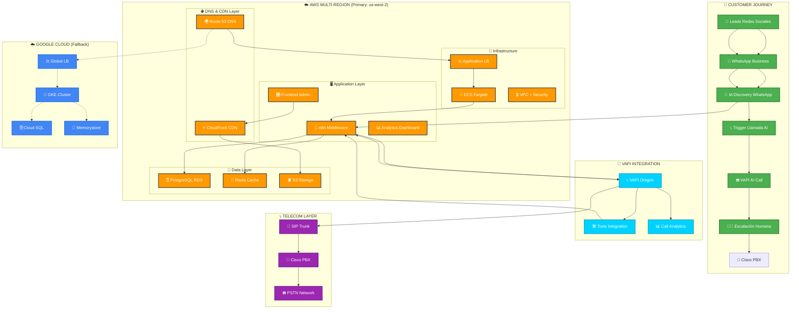

# 🏗️ ARQUITECTURA DE ALTO NIVEL - VIDANTA AI CALL SYSTEM

## 🎯 SERVICIOS PRINCIPALES

### 📱 **Customer Experience Layer**
- **Leads Generation**: Redes sociales → WhatsApp
- **IA Discovery**: Análisis inteligente de mensajes
- **Call Trigger**: Activación automática de llamadas
- **Human Escalation**: Transferencia a agentes humanos

### 🔄 **Integration & Middleware Layer**
- **n8n**: Orquestación de workflows y APIs
- **VAPI Integration**: Gestión de llamadas AI
- **Tools Ecosystem**: Integración con CRMs, APIs
- **Analytics**: Métricas y reporting en tiempo real

### 💾 **Data & Storage Layer**
- **PostgreSQL**: Transacciones, leads, llamadas
- **Redis**: Cache, sesiones, queues
- **S3**: Grabaciones, documentos, backups
- **Analytics DB**: Data warehouse para BI

### ☁️ **Multi-Cloud Infrastructure**
- **AWS Primary**: us-west-2 (Oregon) - Latencia óptima VAPI
- **GCP Secondary**: Failover automático
- **DNS Global**: Route 53 con health checks
- **CDN**: CloudFront para assets estáticos
