# 🔄 FLUJO COMPLETO DE SERVICIOS - VIDANTA AI SYSTEM

## 📱 **CUSTOMER JOURNEY COMPLETO**

```mermaid
sequenceDiagram
    participant Lead as 🎯 Lead
    participant Social as 📱 Redes Sociales
    participant WhatsApp as 📱 WhatsApp Business
    participant WAI as 🤖 WhatsApp AI
    participant N8N as 🔄 n8n Middleware
    participant PG as 🗄️ PostgreSQL
    participant Redis as 🔴 Redis Cache
    participant VAPI as 📞 VAPI AI
    participant Tools as 🛠️ n8n Tools
    participant SIP as 📡 SIP Trunk
    participant Cisco as 🏢 Cisco PBX
    participant Agent as 👨‍💼 Human Agent

    %% Fase 1: Lead Generation
    Note over Lead,Social: 🎯 LEAD GENERATION PHASE
    Lead->>Social: Ve publicidad/contenido
    Social->>WhatsApp: Click "Contactar"
    WhatsApp->>WAI: Mensaje inicial recibido
    WAI->>PG: Registrar nuevo lead
    PG-->>WAI: Lead ID creado
    
    %% Fase 2: Discovery
    Note over WAI,N8N: 🔍 DISCOVERY & QUALIFICATION PHASE
    WAI->>N8N: Trigger discovery workflow
    N8N->>Redis: Cache session data
    N8N->>Tools: Ejecutar discovery tools
    Tools->>PG: Consultar historial
    PG-->>Tools: Datos del lead
    Tools-->>N8N: Información compilada
    N8N->>WAI: Respuesta personalizada
    WAI->>WhatsApp: Mensaje al lead
    WhatsApp->>Lead: Respuesta AI
    
    %% Decisión de llamada
    alt Lead calificado para llamada
        Note over WAI,VAPI: 📞 CALL INITIATION PHASE
        WAI->>N8N: Trigger call workflow
        N8N->>PG: Registrar intent de llamada
        N8N->>Redis: Queue call job
        
        %% Preparación de llamada
        N8N->>Tools: Preparar contexto llamada
        Tools->>PG: Obtener perfil completo
        PG-->>Tools: Datos del lead + historial
        Tools-->>N8N: Contexto compilado
        
        %% Composición JSON para VAPI
        N8N->>N8N: Componer JSON VAPI
        Note right of N8N: Incluye:<br/>- Prompt personalizado<br/>- Contexto del lead<br/>- Tools disponibles<br/>- Objetivos llamada
        
        %% Iniciación de llamada
        N8N->>VAPI: POST /call/initiate
        VAPI-->>N8N: Call ID + Status
        N8N->>PG: Registrar call started
        N8N->>Redis: Cache call context
        
        %% Durante la llamada
        Note over VAPI,Tools: 🔄 DURING CALL PHASE
        VAPI->>Lead: Llamada telefónica
        Lead->>VAPI: Conversación
        
        loop Durante conversación
            VAPI->>Tools: Tool calls (webhooks)
            Tools->>PG: Consultar/Actualizar datos
            Tools->>Redis: Cache respuestas
            Tools-->>VAPI: Respuesta tool
            VAPI->>VAPI: Procesar con AI
            VAPI->>Lead: Respuesta AI
        end
        
        %% Escalación si necesario
        alt Escalación requerida
            Note over VAPI,Agent: 👨‍💼 HUMAN ESCALATION PHASE
            VAPI->>N8N: Webhook escalation_needed
            N8N->>PG: Log escalation request
            N8N->>Redis: Queue transfer
            VAPI->>SIP: Initiate transfer
            SIP->>Cisco: SIP INVITE
            Cisco->>Agent: Ring agent
            Agent->>Cisco: Answer
            Cisco->>SIP: Transfer complete
            SIP->>VAPI: Transfer confirmed
            VAPI->>Agent: Call transferred
            Agent->>Lead: Human conversation
        end
        
        %% Finalización
        Note over VAPI,PG: 📝 CALL COMPLETION PHASE
        alt Call completed
            VAPI->>N8N: Webhook call_ended
            N8N->>PG: Registrar call summary
            N8N->>Redis: Clear call cache
            N8N->>Tools: Post-call processing
            Tools->>PG: Actualizar lead status
            Tools->>PG: Crear follow-up tasks
        end
        
    else Lead no calificado
        WAI->>N8N: Continue nurturing workflow
        N8N->>PG: Update lead score
        N8N->>Redis: Schedule follow-up
    end

    %% Analytics y reporting
    Note over PG,Tools: 📊 ANALYTICS & REPORTING
    PG->>Tools: Trigger analytics
    Tools->>PG: Generar reportes
    Tools->>Redis: Cache metrics
```



## 🔧 **COMPONENTES TÉCNICOS DETALLADOS**

### 📱 **WhatsApp AI Discovery**
```json
{
  "discovery_workflow": {
    "steps": [
      {
        "action": "analyze_message",
        "ai_model": "gpt-4",
        "context": "real_estate_qualification"
      },
      {
        "action": "extract_intent", 
        "fields": ["budget", "timeline", "location", "property_type"]
      },
      {
        "action": "score_lead",
        "criteria": ["qualification_level", "urgency", "budget_fit"]
      },
      {
        "action": "determine_next_action",
        "options": ["schedule_call", "nurture_sequence", "direct_transfer"]
      }
    ]
  }
}
```

### 🔄 **n8n Workflow Configuration**
```json
{
  "call_initiation_workflow": {
    "trigger": "webhook_whatsapp_qualified",
    "nodes": [
      {
        "name": "Lead Context Preparation",
        "type": "function",
        "code": "// Compilar contexto completo del lead"
      },
      {
        "name": "VAPI JSON Composer", 
        "type": "function",
        "code": "// Generar payload optimizado para VAPI"
      },
      {
        "name": "Database Logger",
        "type": "postgres",
        "operation": "insert_call_record"
      },
      {
        "name": "VAPI API Call",
        "type": "http_request",
        "method": "POST",
        "url": "https://api.vapi.ai/call"
      },
      {
        "name": "Redis Cache",
        "type": "redis",
        "operation": "set_call_context"
      }
    ]
  }
}
```

### 📞 **VAPI Configuration JSON**
```json
{
  "call_config": {
    "model": {
      "provider": "openai",
      "model": "gpt-4-turbo",
      "temperature": 0.7,
      "max_tokens": 500
    },
    "voice": {
      "provider": "11labs",
      "voice_id": "pNInz6obpgDQGcFmaJgB",
      "stability": 0.5,
      "similarity_boost": 0.8
    },
    "first_message": "¡Hola! Soy Sofia, asistente de Vidanta. Vi que estás interesado en nuestras propiedades. ¿Te gustaría que conversemos sobre las opciones que mejor se adapten a ti?",
    "system_message": "Eres Sofia, una consultora experta en bienes raíces de lujo de Vidanta. Tu objetivo es calificar leads y agendar visitas. Usa un tono cálido y profesional.",
    "tools": [
      {
        "type": "function",
        "function": {
          "name": "check_availability",
          "description": "Verificar disponibilidad de propiedades",
          "url": "https://ai.vidanta.com/api/tools/availability"
        }
      },
      {
        "type": "function", 
        "function": {
          "name": "schedule_appointment",
          "description": "Agendar cita de visita",
          "url": "https://ai.vidanta.com/api/tools/schedule"
        }
      },
      {
        "type": "function",
        "function": {
          "name": "get_pricing",
          "description": "Obtener información de precios",
          "url": "https://ai.vidanta.com/api/tools/pricing"
        }
      },
      {
        "type": "function",
        "function": {
          "name": "escalate_to_human",
          "description": "Transferir a agente humano",
          "url": "https://ai.vidanta.com/api/tools/escalate"
        }
      }
    ],
    "end_call_conditions": [
      "appointment_scheduled",
      "not_qualified",
      "escalated_to_human"
    ]
  }
}
```

### 🗄️ **Database Schema Optimizado**
```sql
-- Tabla principal de leads
CREATE TABLE leads (
    id UUID PRIMARY KEY DEFAULT gen_random_uuid(),
    phone VARCHAR(20) UNIQUE NOT NULL,
    whatsapp_id VARCHAR(50),
    first_name VARCHAR(100),
    last_name VARCHAR(100),
    email VARCHAR(255),
    lead_source VARCHAR(50),
    qualification_score INTEGER,
    status VARCHAR(20) DEFAULT 'new',
    created_at TIMESTAMP DEFAULT NOW(),
    updated_at TIMESTAMP DEFAULT NOW()
);

-- Tabla de llamadas
CREATE TABLE calls (
    id UUID PRIMARY KEY DEFAULT gen_random_uuid(),
    lead_id UUID REFERENCES leads(id),
    vapi_call_id VARCHAR(100),
    status VARCHAR(20),
    duration_seconds INTEGER,
    transcript TEXT,
    summary TEXT,
    outcome VARCHAR(50),
    escalated BOOLEAN DEFAULT FALSE,
    started_at TIMESTAMP,
    ended_at TIMESTAMP,
    created_at TIMESTAMP DEFAULT NOW()
);

-- Tabla de interacciones
CREATE TABLE interactions (
    id UUID PRIMARY KEY DEFAULT gen_random_uuid(),
    lead_id UUID REFERENCES leads(id),
    call_id UUID REFERENCES calls(id),
    type VARCHAR(20), -- 'whatsapp', 'call', 'tool_call'
    content TEXT,
    metadata JSONB,
    created_at TIMESTAMP DEFAULT NOW()
);

-- Tabla de tool calls durante llamadas
CREATE TABLE tool_calls (
    id UUID PRIMARY KEY DEFAULT gen_random_uuid(),
    call_id UUID REFERENCES calls(id),
    tool_name VARCHAR(100),
    parameters JSONB,
    response JSONB,
    execution_time_ms INTEGER,
    success BOOLEAN,
    created_at TIMESTAMP DEFAULT NOW()
);

-- Índices para performance
CREATE INDEX idx_leads_phone ON leads(phone);
CREATE INDEX idx_calls_lead_id ON calls(lead_id);
CREATE INDEX idx_calls_status ON calls(status);
CREATE INDEX idx_interactions_lead_id ON interactions(lead_id);
CREATE INDEX idx_interactions_created_at ON interactions(created_at);
CREATE INDEX idx_tool_calls_call_id ON tool_calls(call_id);
```

### 🔴 **Redis Cache Strategy**
```yaml
Redis Usage Patterns:

Session Cache:
  Key Pattern: "session:{lead_id}"
  TTL: 24 hours
  Data: Lead context, conversation state

Call Context:
  Key Pattern: "call:{call_id}"
  TTL: 2 hours  
  Data: VAPI config, tools responses

Queue Processing:
  Key Pattern: "queue:calls"
  Type: List (FIFO)
  Data: Pending call jobs

Real-time Metrics:
  Key Pattern: "metrics:{date}"
  TTL: 7 days
  Data: Call volumes, success rates

Tool Responses Cache:
  Key Pattern: "tool:{tool_name}:{hash}"
  TTL: 1 hour
  Data: Cached API responses
```

## 📊 **MÉTRICAS Y MONITOREO**

### 🎯 **KPIs Principales**
- **Lead to Call Conversion**: % leads que reciben llamada
- **Call Success Rate**: % llamadas completadas exitosamente  
- **Escalation Rate**: % llamadas transferidas a humanos
- **Appointment Booking Rate**: % llamadas que generan citas
- **Average Call Duration**: Duración promedio de llamadas
- **Tool Call Success Rate**: % tool calls exitosos
- **Response Time**: Latencia promedio de tools
- **System Uptime**: Disponibilidad del sistema

### 📈 **Dashboards en Tiempo Real**
- **Operations Dashboard**: Estado de servicios, métricas sistema
- **Sales Dashboard**: Conversiones, pipeline, ROI
- **Technical Dashboard**: Performance, errores, latencias
- **Executive Dashboard**: KPIs de negocio, tendencias
