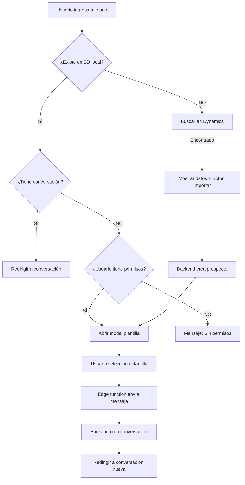

# Fix: Flujo de Creación de Conversación con Plantilla WhatsApp

**Fecha:** 28 de Enero 2026  
**Componentes:** `QuickImportModal.tsx`, `LiveChatModule.tsx`  
**Tipo:** Mejora de flujo UX

---

## 🐛 Problema Original

Al importar un prospecto nuevo, el sistema intentaba crear una conversación directamente desde el frontend, pero fallaba por **Row Level Security (RLS)**:

```
Error: new row violates row-level security policy for table "conversaciones_whatsapp"
```

**Razón:** La tabla `conversaciones_whatsapp` tiene políticas RLS que bloquean INSERT directo desde frontend.

---

## ✅ Solución Implementada

### Nuevo Flujo

1. **Usuario busca número** → Busca en BD local primero
2. **Si NO existe** → Busca en Dynamics CRM
3. **Importa prospecto** → Backend crea registro en `prospectos`
4. **Abre modal de plantilla** → Usuario selecciona plantilla WhatsApp
5. **Envía plantilla** → Edge function envía mensaje via N8N
6. **Backend crea conversación** → Al enviar mensaje, N8N/backend crea automáticamente el registro en `conversaciones_whatsapp`
7. **Redirige a conversación** → Usuario ve la nueva conversación

### Ventajas del Nuevo Flujo

✅ **Respeta RLS** - No intenta INSERT directo desde frontend  
✅ **Mejor UX** - Usuario inicia conversación con mensaje significativo (plantilla)  
✅ **Consistente** - Mismo flujo que reactivar conversación existente  
✅ **Backend controla** - La creación de conversación siempre la hace el backend

---

## 📝 Cambios en Código

### 1. `QuickImportModal.tsx`

#### Interface actualizada
```typescript
// ANTES
interface QuickImportModalProps {
  onSuccess: (conversacionId: string) => void;
}

// AHORA
interface QuickImportModalProps {
  onSuccess: (prospectoId: string) => void; // Cambiado a prospectoId
}
```

#### Función `handleImport` simplificada
```typescript
// ANTES: Intentaba crear conversación
if (!conversacionId) {
  const { data: newConversacion } = await analysisSupabase
    .from('conversaciones_whatsapp')
    .insert({ ... }); // ❌ Fallaba por RLS
}

// AHORA: Solo importa y pasa el prospectoId
if (result.success && result.prospecto_id) {
  toast.success('Prospecto importado exitosamente');
  onClose();
  onSuccess(result.prospecto_id); // ✅ Pasa prospectoId al padre
}
```

#### Función `handleGoToConversation` mejorada
```typescript
const handleGoToConversation = () => {
  if (!existingProspect) return;

  if (existingProspect.conversacion_id) {
    // ✅ Tiene conversación → ir directamente
    window.location.href = `/live-chat?conversation=${existingProspect.conversacion_id}`;
  } else {
    // ✅ Sin conversación → abrir modal de plantilla
    onSuccess(existingProspect.id);
    onClose();
  }
};
```

### 2. `LiveChatModule.tsx`

#### Estados agregados
```typescript
const [showTemplateModal, setShowTemplateModal] = useState(false);
const [selectedProspectoId, setSelectedProspectoId] = useState<string | null>(null);
```

#### Handler actualizado
```typescript
// ANTES: Redirigía a conversación directamente
const handleQuickImportSuccess = (conversacionId: string) => {
  window.location.href = `/live-chat?conversation=${conversacionId}`;
};

// AHORA: Abre modal de plantilla
const handleQuickImportSuccess = (prospectoId: string) => {
  setShowQuickImportModal(false);
  setSelectedProspectoId(prospectoId);
  setShowTemplateModal(true); // ✅ Abre modal de plantilla
};
```

#### Modal de plantilla agregado
```tsx
{showTemplateModal && selectedProspectoId && (
  <ReactivateConversationModal
    isOpen={showTemplateModal}
    onClose={() => {
      setShowTemplateModal(false);
      setSelectedProspectoId(null);
    }}
    prospectoId={selectedProspectoId}
    onSent={() => {
      setShowTemplateModal(false);
      setSelectedProspectoId(null);
      window.location.reload(); // Recargar para mostrar nueva conversación
    }}
  />
)}
```

---

## 🎯 Casos de Uso

### Caso 1: Importar prospecto nuevo desde Dynamics
```
1. Usuario ingresa teléfono: 5511112222
2. Sistema busca en BD local: ❌ No existe
3. Sistema busca en Dynamics: ✅ Encontrado
4. Usuario hace clic en "Importar"
5. Backend crea prospecto en BD
6. Se abre modal de plantillas WhatsApp
7. Usuario selecciona plantilla (ej: "Bienvenida Vidanta")
8. Sistema envía plantilla via edge function
9. Backend crea conversación automáticamente
10. Usuario es redirigido a la nueva conversación
```

### Caso 2: Prospecto existente sin conversación
```
1. Usuario ingresa teléfono: 5522998337
2. Sistema busca en BD local: ✅ Existe (sin conversación)
3. Sistema valida permisos: ✅ Tiene acceso
4. Botón: "Iniciar Conversación"
5. Se abre modal de plantillas WhatsApp
6. Usuario selecciona plantilla
7. Sistema envía plantilla
8. Backend crea conversación
9. Usuario es redirigido a la conversación
```

### Caso 3: Prospecto existente con conversación
```
1. Usuario ingresa teléfono: 5533334444
2. Sistema busca en BD local: ✅ Existe (con conversación)
3. Sistema valida permisos: ✅ Tiene acceso
4. Botón: "Ir a Conversación"
5. Usuario es redirigido directamente a la conversación existente
```

---

## 🔄 Flujo Completo (Diagrama)



---

## 🧪 Testing

### Probar importación nueva
```bash
1. Buscar número NO existente: 5599998888
2. Encontrar en Dynamics
3. Importar
4. Verificar que se abre modal de plantillas
5. Seleccionar plantilla
6. Enviar
7. Verificar que se crea conversación en BD
8. Verificar redirección a conversación
```

### Probar prospecto existente sin conversación
```bash
1. Buscar número existente: 5522998337
2. Verificar mensaje "Prospecto existe sin conversación"
3. Clic en "Iniciar Conversación"
4. Verificar que se abre modal de plantillas
5. Seleccionar plantilla y enviar
6. Verificar que se crea conversación
```

---

## 📊 Comparación Antes/Después

| Aspecto | Antes ❌ | Ahora ✅ |
|---------|---------|----------|
| Creación conversación | Frontend (fallaba RLS) | Backend (al enviar mensaje) |
| Mensaje inicial | Vacío | Plantilla WhatsApp significativa |
| UX | Error → frustración | Flujo guiado → satisfacción |
| Consistencia | Flujo diferente para nuevos vs existentes | Mismo flujo (modal plantilla) |
| Permisos | Violaba RLS | Respeta RLS |

---

## 📚 Archivos Modificados

1. ✅ `/src/components/chat/QuickImportModal.tsx`
   - Actualizada interfaz `QuickImportModalProps`
   - Simplificado `handleImport`
   - Mejorado `handleGoToConversation`

2. ✅ `/src/components/chat/LiveChatModule.tsx`
   - Agregados estados `showTemplateModal` y `selectedProspectoId`
   - Actualizado `handleQuickImportSuccess`
   - Agregado `ReactivateConversationModal` al render
   - Importado componente `ReactivateConversationModal`

---

## ✅ Verificación

**Checklist de pruebas:**
- [ ] Importar prospecto nuevo abre modal de plantilla
- [ ] Prospecto existente sin conversación abre modal de plantilla
- [ ] Prospecto existente con conversación redirige directamente
- [ ] Envío de plantilla crea conversación en BD
- [ ] Usuario es redirigido correctamente después de enviar
- [ ] No hay errores RLS en consola
- [ ] Validación de permisos funciona correctamente

---

**Estado:** ✅ Implementado  
**Pendiente:** Testing con usuario real  
**Documentación:** Este archivo + código comentado
