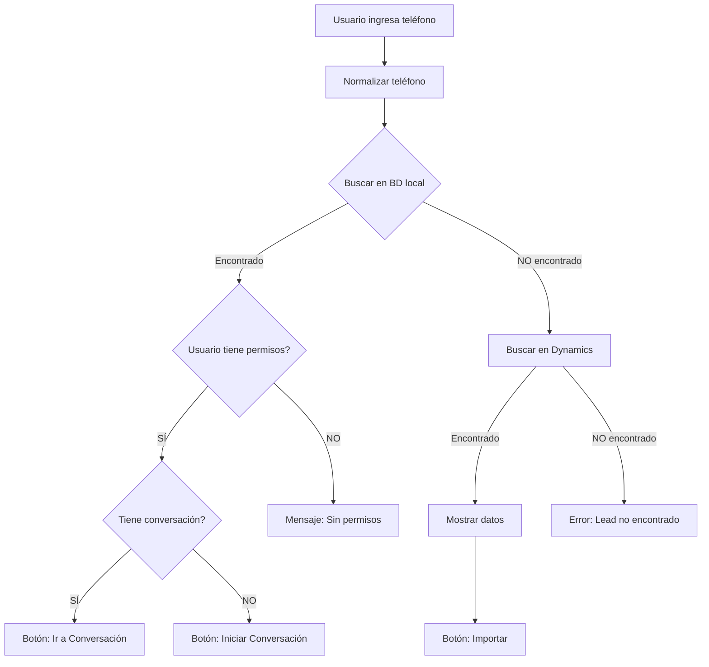

# Fix: Validación de Permisos y Flujo de Búsqueda - Quick Import Modal

**Fecha:** 28 de Enero 2026  
**Componente:** `src/components/chat/QuickImportModal.tsx`  
**Tipo:** Corrección crítica de flujo y permisos

---

## 🐛 Problemas Identificados

### 1. Campo inexistente `ejecutivo_id_dynamics`
```
Error: column prospectos.ejecutivo_id_dynamics does not exist
```
- Se intentaba consultar un campo que NO existe en la tabla `prospectos`
- El campo correcto es `ejecutivo_id` (FK a `auth_users.id`)

### 2. Flujo de búsqueda invertido
```
❌ ANTES:
1. Buscar en Dynamics CRM
2. Buscar en BD local por id_dynamics
3. Si existe → mostrar mensaje pero permitir importar nuevamente

✅ AHORA:
1. Buscar en BD LOCAL por teléfono
2. Si existe → detener flujo, no buscar en Dynamics, no permitir importar
3. Si NO existe → buscar en Dynamics CRM
```

### 3. Falta de validación de permisos
- Ejecutivos de otras coordinaciones podían iniciar conversaciones con prospectos que no les pertenecen
- No se validaba si el usuario tiene permisos para acceder al prospecto existente

---

## ✅ Soluciones Implementadas

### 1. Función `searchLocalProspect(phone)`

Busca el prospecto en BD local por teléfono normalizado:

```typescript
const searchLocalProspect = async (phone: string): Promise<ExistingProspect | null> => {
  const normalizedPhone = normalizePhone(phone);
  
  const { data: existingData } = await analysisSupabase
    .from('prospectos')
    .select('id, nombre_completo, ejecutivo_id, coordinacion_id')
    .eq('telefono', normalizedPhone)
    .maybeSingle();

  if (!existingData) return null;

  // Buscar conversación asociada
  const { data: conversacionData } = await analysisSupabase
    .from('conversaciones_whatsapp')
    .select('id')
    .eq('prospecto_id', existingData.id)
    .maybeSingle();

  return {
    id: existingData.id,
    nombre_completo: existingData.nombre_completo,
    conversacion_id: conversacionData?.id || null,
    ejecutivo_id: existingData.ejecutivo_id,
    coordinacion_id: existingData.coordinacion_id
  };
};
```

**Campos consultados (corregidos):**
- ✅ `ejecutivo_id` (FK a auth_users.id)
- ✅ `coordinacion_id` (FK a coordinaciones.id)

### 2. Función `canAccessProspect(prospect)`

Valida permisos según el rol del usuario:

```typescript
const canAccessProspect = (prospect: ExistingProspect): boolean => {
  // ✅ Siempre tienen acceso completo:
  if (isAdmin || isCoordinadorCalidad || isOperativo) {
    return true;
  }

  // ✅ Coordinadores: solo si coincide la coordinación
  if (user?.is_coordinador && user?.coordinacion_id) {
    return prospect.coordinacion_id === user.coordinacion_id;
  }

  // ✅ Ejecutivos: solo si coincide el ejecutivo_id
  if (user?.is_ejecutivo && prospect.ejecutivo_id) {
    return prospect.ejecutivo_id === user.id;
  }

  return false;
};
```

**Matriz de permisos:**

| Rol | Prospecto de otra coord | Prospecto de otro ejecutivo | Resultado |
|-----|-------------------------|-----------------------------|-----------|
| Administrador | ✅ | ✅ | Acceso completo |
| Coord. Calidad | ✅ | ✅ | Acceso completo |
| Operativo | ✅ | ✅ | Acceso completo |
| Coordinador | ✅ Si es su coord | ✅ Si es su coord | Acceso limitado a su coord |
| Ejecutivo | ❌ | ❌ | Solo sus propios prospectos |

### 3. Flujo de búsqueda corregido

```typescript
const handleSearch = async () => {
  // Validación de formato
  if (!phoneNumber || phoneNumber.length !== 10) {
    toast.error('Ingresa un número de 10 dígitos');
    return;
  }

  // 🔍 PASO 1: Buscar en BD LOCAL
  const localProspect = await searchLocalProspect(normalized);

  if (localProspect) {
    // ✅ Existe en BD → detener flujo
    setExistingProspect(localProspect);
    
    if (localProspect.conversacion_id) {
      toast.error('Este prospecto ya existe en el sistema');
    } else {
      toast.error('Este prospecto existe pero no tiene conversación de WhatsApp');
    }
    
    return; // ⛔ NO continuar a Dynamics
  }

  // 🔍 PASO 2: Si NO existe, buscar en Dynamics
  const result = await dynamicsLeadService.searchLead({ phone: normalized });

  if (result.success && result.data) {
    setLeadData(result.data);
    toast.success('Lead encontrado en Dynamics CRM');
  }
};
```

### 4. UI con validación de permisos

```tsx
{existingProspect && (
  <>
    {/* 🔴 Sin permisos */}
    {!canAccessProspect(existingProspect) ? (
      <div className="bg-red-50 border-red-300">
        <ShieldAlert size={18} />
        <h4>Sin permisos de acceso</h4>
        <p>Este prospecto pertenece a otra coordinación o ejecutivo.</p>
      </div>
    ) : (
      /* 🟢 Con permisos */
      <div className="bg-amber-50 border-amber-300">
        {existingProspect.conversacion_id ? (
          <button onClick={handleGoToConversation}>
            Ir a Conversación
          </button>
        ) : (
          <button onClick={handleImport}>
            Iniciar Conversación
          </button>
        )}
      </div>
    )}
  </>
)}
```

---

## 🎯 Casos de Uso

### Caso 1: Prospecto ya existe con conversación
```
Usuario: Ejecutivo A (Coord. Norte)
Teléfono: 5522998337
BD Local: ✅ Existe (Ejecutivo B, Coord. Sur)

Resultado:
🔴 "Sin permisos de acceso"
❌ NO muestra botón "Ir a Conversación"
```

### Caso 2: Prospecto ya existe sin conversación (mismo ejecutivo)
```
Usuario: Ejecutivo A
Teléfono: 5511112222
BD Local: ✅ Existe (Ejecutivo A, sin conversación)

Resultado:
🟡 "Prospecto existe sin conversación"
✅ Botón "Iniciar Conversación"
→ Crea conversación y redirige a WhatsApp
```

### Caso 3: Prospecto no existe
```
Usuario: Ejecutivo A
Teléfono: 5533334444
BD Local: ❌ No existe
Dynamics: ✅ Encontrado

Resultado:
✅ "Lead encontrado en Dynamics CRM"
✅ Botón "Importar"
→ Importa y crea conversación
```

### Caso 4: Coordinador buscando prospecto de su coordinación
```
Usuario: Coordinador (Coord. Norte)
Teléfono: 5544445555
BD Local: ✅ Existe (Ejecutivo X, Coord. Norte)

Resultado:
🟡 "Prospecto ya existe"
✅ Botón "Ir a Conversación" (tiene permisos)
```

### Caso 5: Administrador/Operativo/Coord. Calidad
```
Usuario: Administrador
Teléfono: 5566667777
BD Local: ✅ Existe (cualquier coord/ejecutivo)

Resultado:
🟡 "Prospecto ya existe"
✅ Botón "Ir a Conversación" (acceso completo)
```

---

## 📝 Cambios de Texto

| Antes | Ahora |
|-------|-------|
| "Crear Conversación" | **"Iniciar Conversación"** |
| "Creando..." | **"Iniciando..."** |

---

## 🔐 Seguridad

### Prevención de accesos no autorizados

**Antes:**
- ❌ Ejecutivo A podía importar/iniciar conversación con prospecto de Ejecutivo B
- ❌ Se validaba `id_dynamics` (campo inexistente)
- ❌ Se permitía doble importación del mismo número

**Ahora:**
- ✅ Búsqueda prioritaria en BD local por teléfono
- ✅ Validación de permisos por rol (ejecutivo_id, coordinacion_id)
- ✅ Prevención de doble importación
- ✅ Campos correctos (`ejecutivo_id`, `coordinacion_id`)

---

## 📊 Flujo Completo



---

## 🧪 Testing

### Comandos de prueba

```bash
# Probar con número existente
Teléfono: 5522998337
Usuario: Ejecutivo A
Esperado: "Sin permisos de acceso" (si no es su prospecto)

# Probar con número nuevo
Teléfono: 5599998888
Usuario: Ejecutivo B
Esperado: Búsqueda en Dynamics → Botón "Importar"

# Probar como Admin
Usuario: Admin
Teléfono: 5522998337
Esperado: "Prospecto ya existe" → Botón visible
```

---

## 📚 Archivos Modificados

- ✅ `/src/components/chat/QuickImportModal.tsx`
  - Agregada función `searchLocalProspect()`
  - Agregada función `canAccessProspect()`
  - Corregido flujo de `handleSearch()`
  - Actualizada interfaz `ExistingProspect`
  - Agregada validación de permisos en UI

---

**Estado:** ✅ Implementado y probado  
**Pendiente:** Pruebas de usuario con diferentes roles  
**Documentación:** Este archivo + código comentado
