# 🏗️ Diagramas de Arquitectura - PQNC QA AI Platform

**Fecha:** 2025-01-25  
**Versión:** 1.0.14  
**Propósito:** Diagramas completos de flujos de aplicación y base de datos

---

## 📱 **DIAGRAMA DE FLUJO DE APLICACIÓN**

### **Flujo Principal de Navegación**

```mermaid
flowchart TD
    A[Inicio de Aplicación] --> B{Usuario Autenticado?}
    B -->|No| C[LoginScreen]
    B -->|Sí| D[MainApp]
    
    C --> E[AuthContext.login()]
    E --> F{Credenciales Válidas?}
    F -->|No| C
    F -->|Sí| G[LightSpeedTunnel Animation]
    G --> D
    
    D --> H[Sidebar + Header + Footer]
    H --> I{Rol del Usuario}
    
    I -->|Admin| J[Todos los Módulos]
    I -->|Developer| K[Constructor + Plantillas]
    I -->|Evaluator| L[Módulos Configurados]
    I -->|Vendedor| M[PQNC + Live Monitor]
    
    J --> N[Constructor]
    J --> O[Plantillas]
    J --> P[Natalia IA]
    J --> Q[PQNC Humans]
    J --> R[Live Monitor]
    J --> S[Administración]
    
    K --> N
    K --> O
    
    L --> T{Permisos Específicos}
    T -->|Natalia| P
    T -->|PQNC| Q
    T -->|Live Monitor| R
    
    M --> Q
    M --> R
```

### **Flujo del Constructor de Agentes**

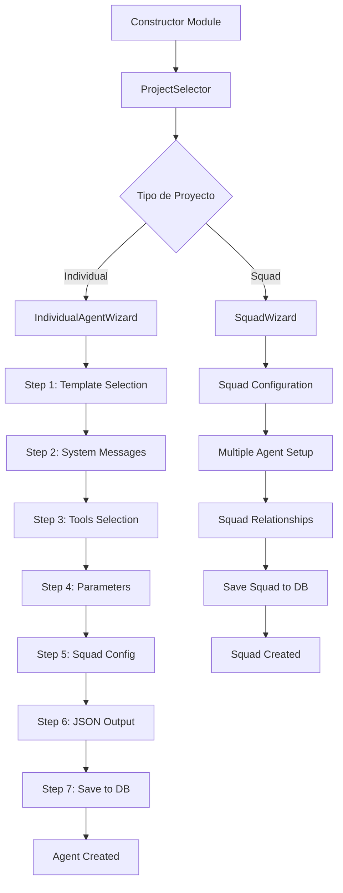

### **Flujo del Módulo Live Monitor**

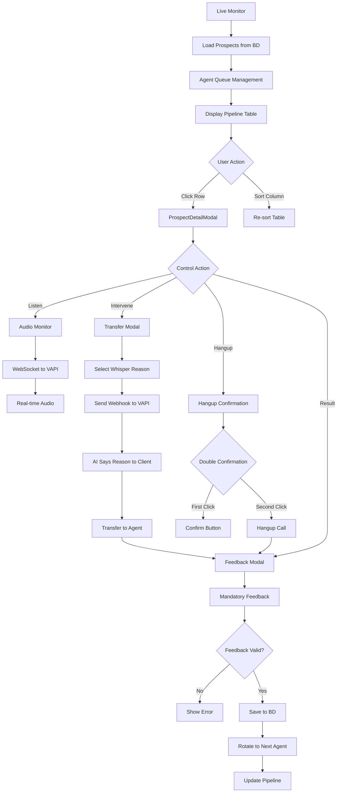

### **Flujo del Sistema de Análisis**

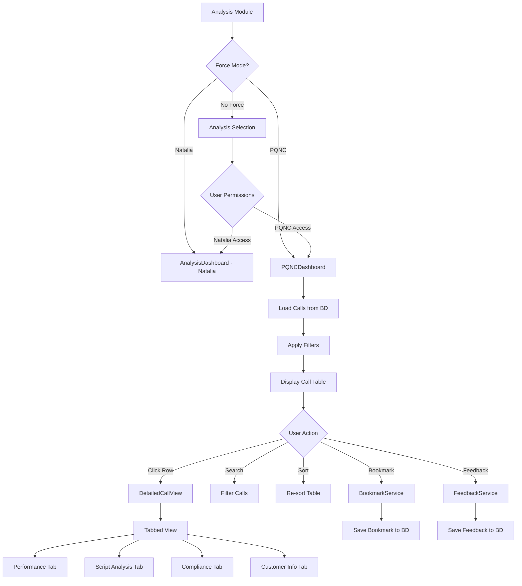

---

## 🗄️ **DIAGRAMA DE BASE DE DATOS**

### **Estructura General de Bases de Datos**

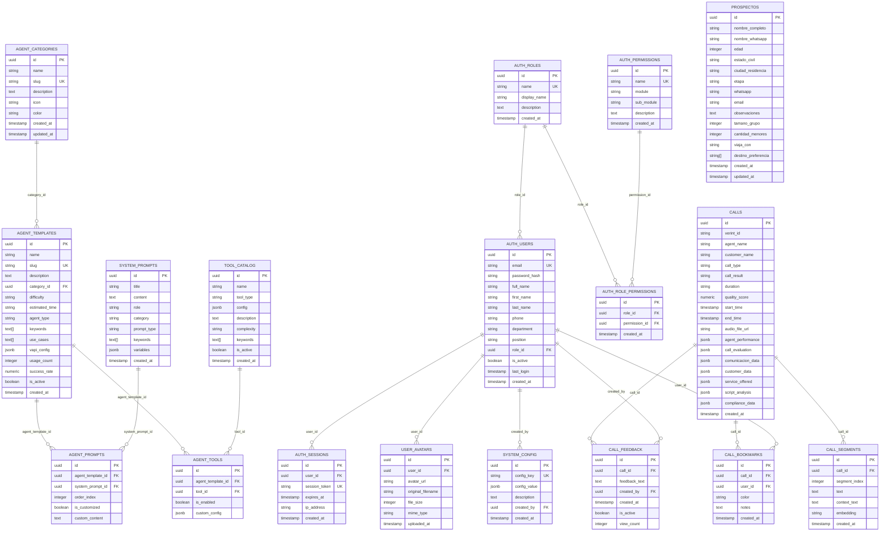

### **Flujo de Datos entre Bases de Datos**

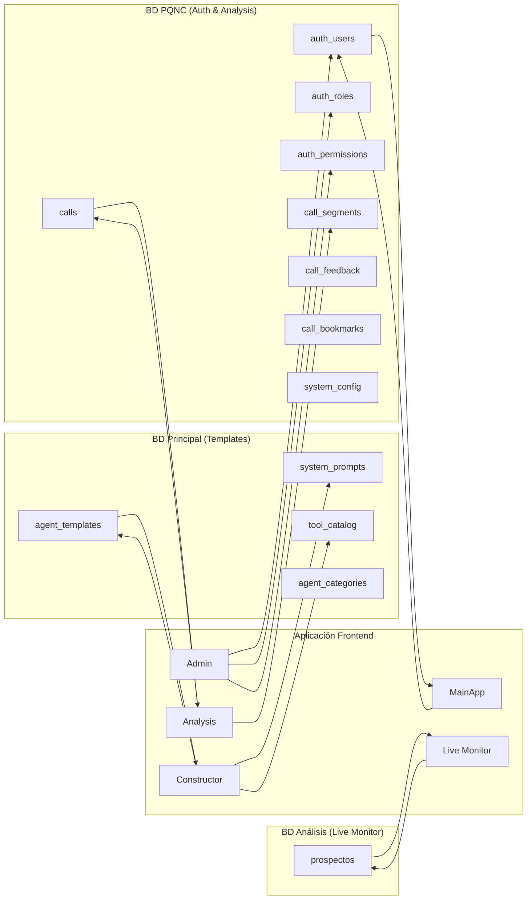

---

## 🔄 **FLUJOS DE OPERACIÓN DETALLADOS**

### **Flujo de Autenticación y Permisos**

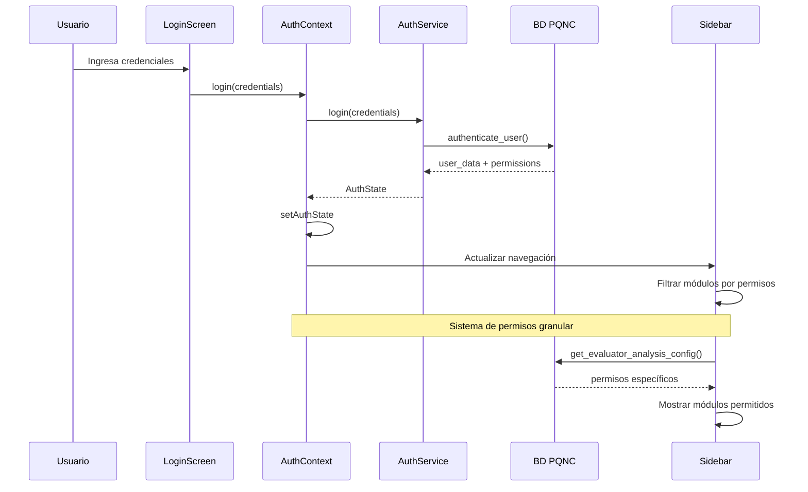

### **Flujo del Constructor de Agentes**

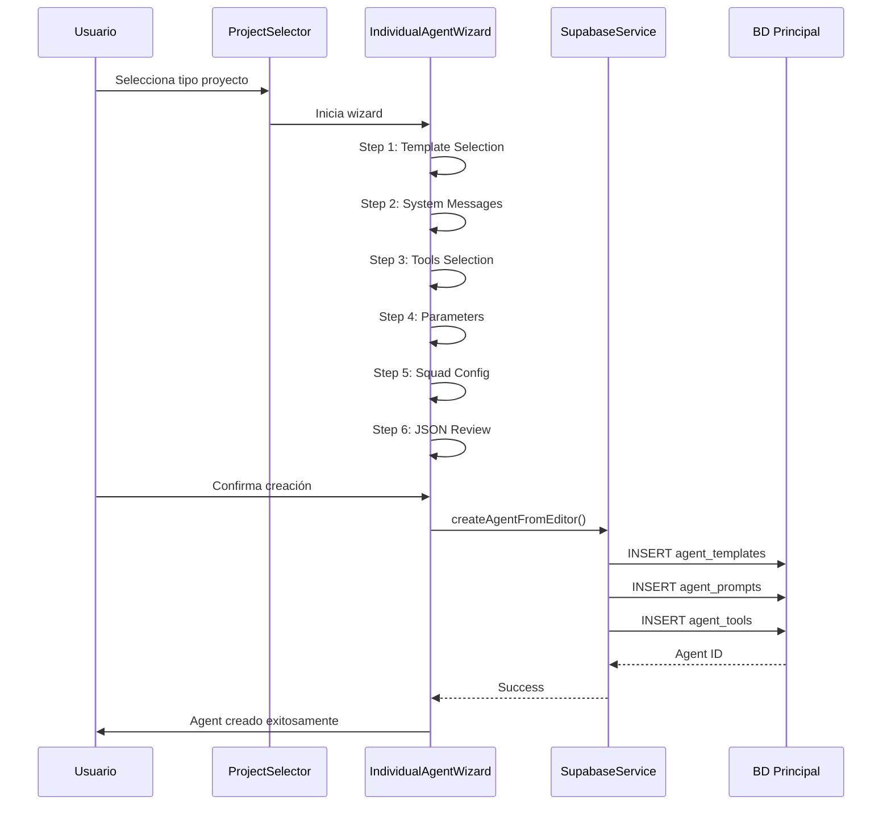

### **Flujo del Live Monitor**

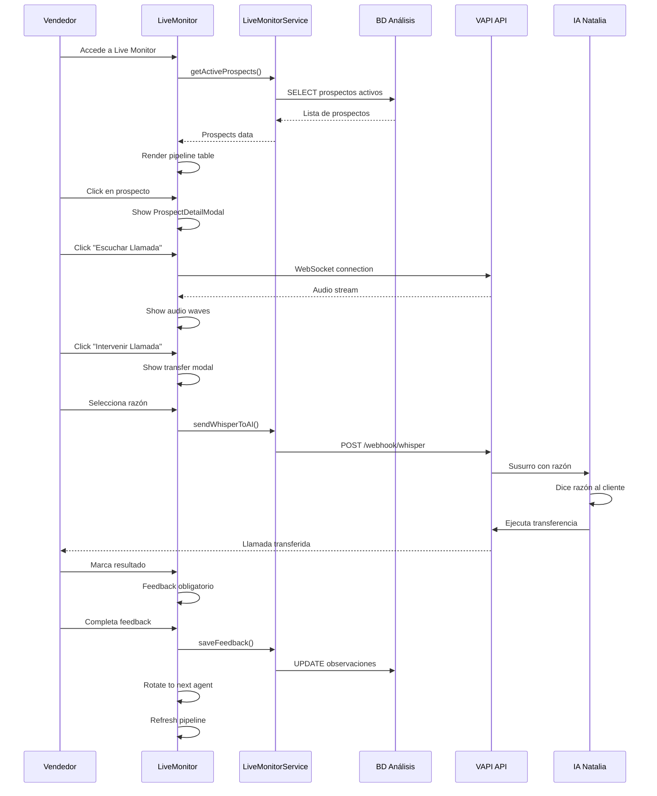

### **Flujo del Sistema de Análisis PQNC**

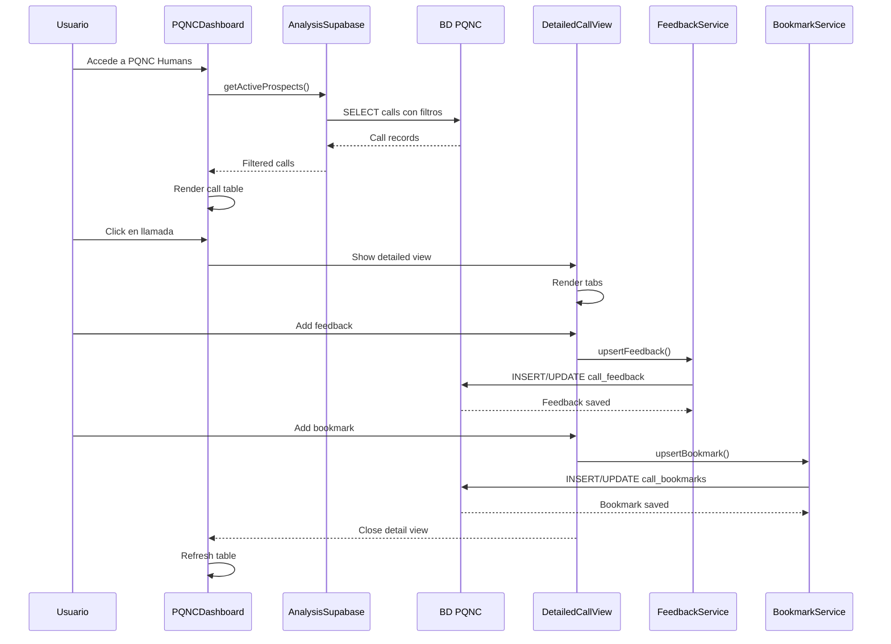

---

## 🔐 **FLUJO DEL SISTEMA DE PERMISOS**

### **Gestión Dinámica de Permisos para Evaluadores**

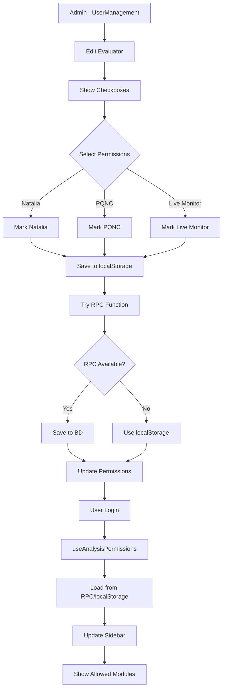

### **Flujo de Autenticación Completo**

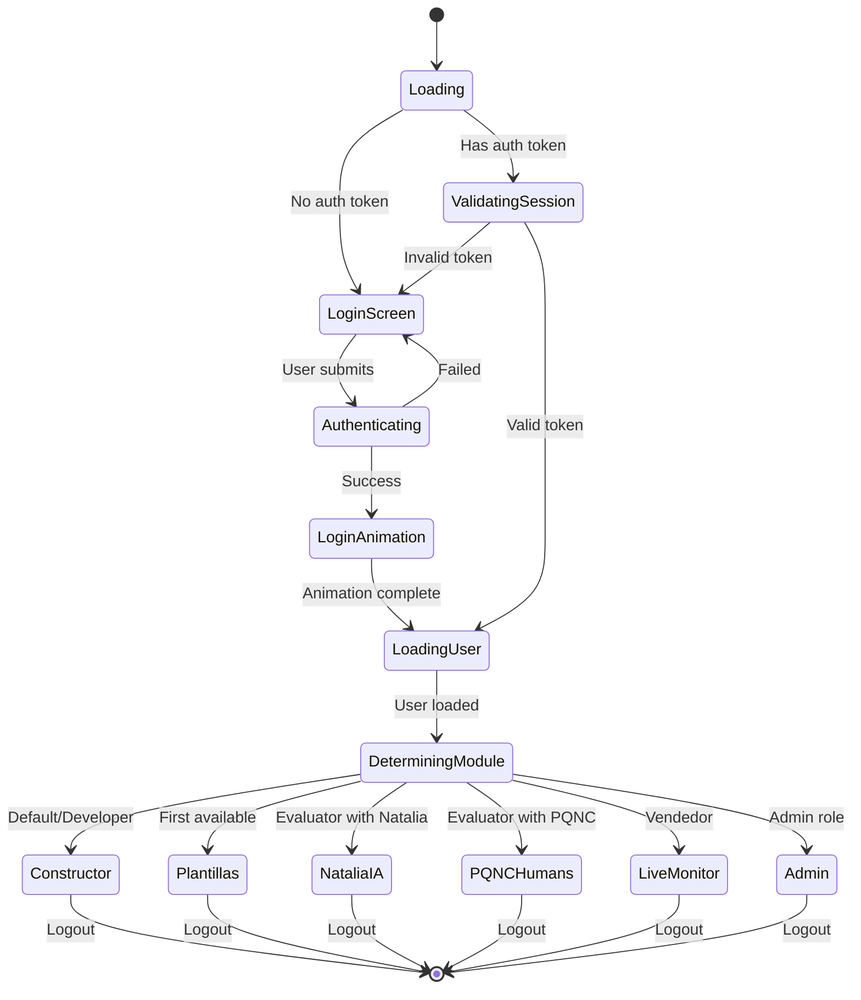

---

## 📊 **FLUJO DE DATOS EN TIEMPO REAL**

### **Live Monitor - Tiempo Real**

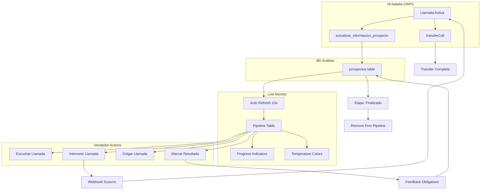

---

## 🎯 **ARQUITECTURA DE COMPONENTES**

### **Jerarquía de Componentes Principales**

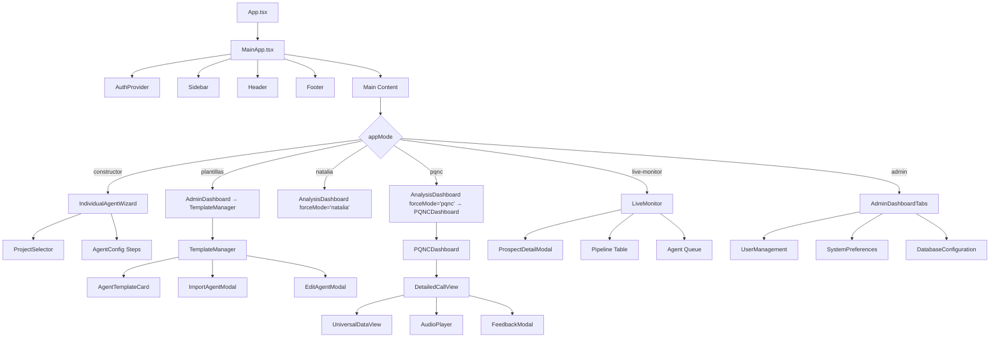

---

## 🔧 **SERVICIOS Y HOOKS**

### **Arquitectura de Servicios**

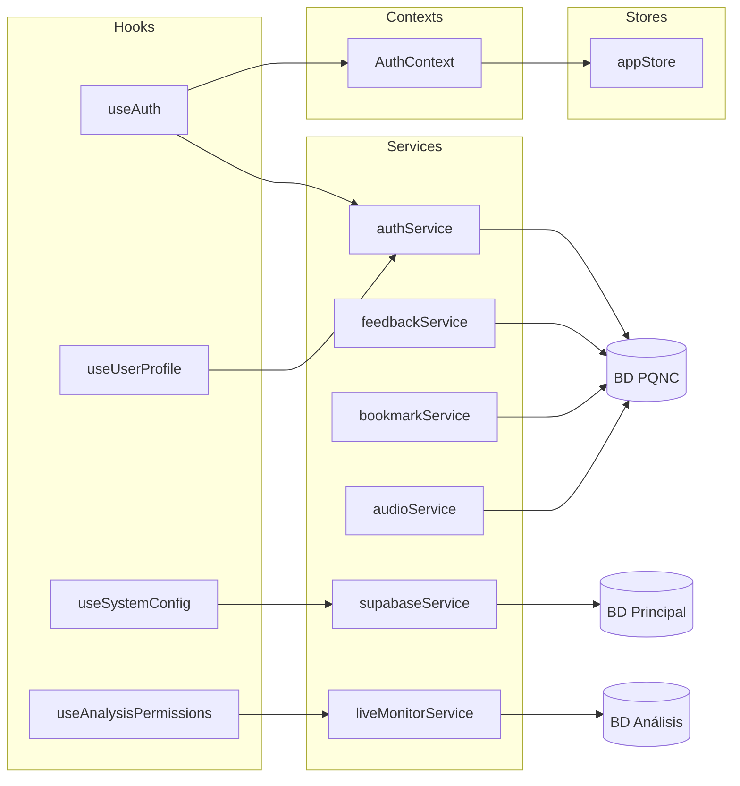

---

## 📈 **MÉTRICAS Y RENDIMIENTO**

### **Flujo de Optimización de Performance**

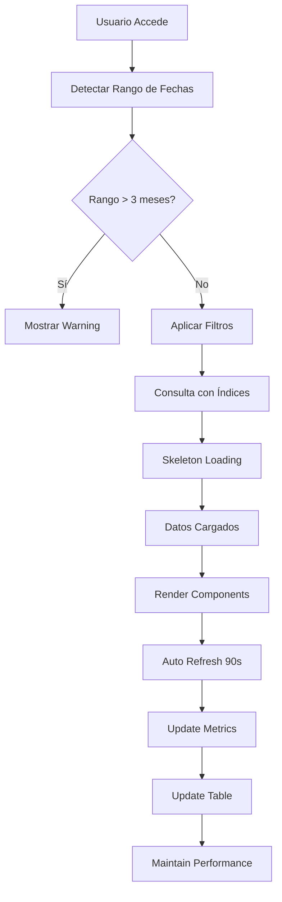

Este sistema de diagramas proporciona una **visión completa** de:

1. **Flujos de aplicación**: Navegación, autenticación, módulos
2. **Estructura de BD**: 3 bases de datos con relaciones
3. **Operaciones en tiempo real**: Live Monitor y análisis
4. **Sistema de permisos**: Gestión dinámica granular
5. **Arquitectura de componentes**: Jerarquía completa
6. **Servicios y hooks**: Interacciones de datos

¿Te gustaría que profundice en algún flujo específico o que agregue más detalles a algún diagrama en particular?
