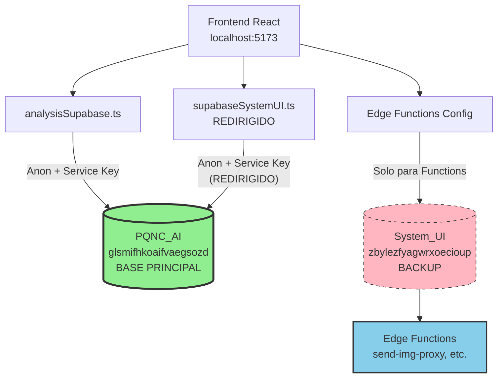

# Nueva Arquitectura: Base de Datos Unificada

**Fecha de Implementación:** 13 de Enero 2025  
**Versión:** v2.2.0  
**Estado:** ✅ PRODUCCIÓN

---

## Resumen

Desde el 13 de Enero 2025, **TODA la base de datos** vive en un solo proyecto de Supabase: **PQNC_AI** (glsmifhkoaifvaegsozd.supabase.co).

---

## Base de Datos Única: PQNC_AI

**URL:** `https://glsmifhkoaifvaegsozd.supabase.co`  
**Proyecto:** glsmifhkoaifvaegsozd  
**Nombre:** pqnc_ai

### Contiene TODO:

```
✅ Autenticación y Usuarios
   - auth_users, auth_roles, auth_sessions
   - auth_permissions, auth_user_permissions
   - auth_user_coordinaciones

✅ Permisos Avanzados
   - permission_groups, group_permissions
   - user_permission_groups

✅ Coordinaciones y Asignaciones
   - coordinaciones
   - prospect_assignments, assignment_logs

✅ Prospectos y Llamadas
   - prospectos
   - llamadas_ventas
   - call_analysis_summary

✅ WhatsApp y Mensajería
   - conversaciones_whatsapp
   - mensajes_whatsapp
   - whatsapp_*_labels

✅ Configuración
   - system_config, app_themes
   - api_auth_tokens
   - bot_pause_status
   - uchat_bots, uchat_conversations

✅ Logs y Moderación
   - auth_login_logs
   - paraphrase_logs
   - content_moderation_warnings
   - user_warning_counters

✅ Vistas Optimizadas
   - auth_user_profiles
   - prospectos_con_ejecutivo_y_coordinacion
   - conversaciones_whatsapp_enriched
   - llamadas_activas_con_prospecto
```

---

## System_UI: SOLO BACKUP

**URL:** `https://zbylezfyagwrxoecioup.supabase.co`  
**Proyecto:** zbylezfyagwrxoecioup  
**Estado:** BACKUP/ARCHIVADO (desde 2025-01-13)

### Uso Permitido:

✅ **Consultas de auditoría histórica**  
✅ **Backup en caso de emergencia**  
✅ **Edge Functions** (permanecen desplegadas aquí)

### Uso PROHIBIDO:

❌ **Insertar datos nuevos**  
❌ **Actualizar registros existentes**  
❌ **Usar como fuente de verdad**  
❌ **Crear usuarios/sesiones/permisos nuevos**

---

## Edge Functions

**Ubicación:** System_UI (zbylezfyagwrxoecioup.supabase.co)  
**Razón:** Ya están desplegadas ahí, no requieren migración

### Funciones Disponibles:

- `send-img-proxy` - Proxy para envío de imágenes WhatsApp
- `n8n-proxy` - Proxy para N8N webhooks
- `anthropic-proxy` - Proxy para Anthropic API
- `error-analisis-proxy` - Proxy para análisis de errores
- `generar-url-optimizada` - Generación de URLs cortas

### Configuración en Frontend:

```typescript
// Variables específicas para Edge Functions
const EDGE_FUNCTIONS_URL = import.meta.env.VITE_EDGE_FUNCTIONS_URL;
// https://zbylezfyagwrxoecioup.supabase.co

const EDGE_FUNCTIONS_ANON_KEY = import.meta.env.VITE_EDGE_FUNCTIONS_ANON_KEY;
```

---

## Variables de Entorno

### Configuración Actual (.env.local)

```bash
# ============================================
# PQNC_AI - BASE DE DATOS PRINCIPAL (TODO UNIFICADO)
# ============================================
VITE_ANALYSIS_SUPABASE_URL=https://glsmifhkoaifvaegsozd.supabase.co
VITE_ANALYSIS_SUPABASE_ANON_KEY=<anon_key>
VITE_ANALYSIS_SUPABASE_SERVICE_KEY=<service_key>

# También se usa como:
VITE_NATALIA_SUPABASE_URL=https://glsmifhkoaifvaegsozd.supabase.co
VITE_NATALIA_SUPABASE_ANON_KEY=<same_anon_key>
VITE_NATALIA_SUPABASE_SERVICE_KEY=<same_service_key>

# ============================================
# SYSTEM_UI - MIGRACIÓN 2025-01-13
# Ahora apunta a PQNC_AI (BD unificada)
# ============================================
VITE_SYSTEM_UI_SUPABASE_URL=https://glsmifhkoaifvaegsozd.supabase.co
VITE_SYSTEM_UI_SUPABASE_ANON_KEY=<same_anon_key>
VITE_SYSTEM_UI_SUPABASE_SERVICE_KEY=<same_service_key>

# ============================================
# EDGE FUNCTIONS - Permanecen en System_UI
# ============================================
VITE_EDGE_FUNCTIONS_URL=https://zbylezfyagwrxoecioup.supabase.co
VITE_EDGE_FUNCTIONS_ANON_KEY=<system_ui_anon_key>
```

---

## Clientes de Supabase en el Código

### analysisSupabase (Principal)

**Archivo:** `src/config/analysisSupabase.ts`  
**URL:** VITE_ANALYSIS_SUPABASE_URL (glsmifhkoaifvaegsozd)  
**Uso:** Prospectos, llamadas, análisis, WhatsApp

### supabaseSystemUI (Redirigido)

**Archivo:** `src/config/supabaseSystemUI.ts`  
**URL:** VITE_SYSTEM_UI_SUPABASE_URL (ahora apunta a glsmifhkoaifvaegsozd)  
**Uso:** Auth, usuarios, permisos (MIGRADO a PQNC_AI)

### pqncSupabase (OBSOLETO - NO USAR)

**Archivo:** `src/config/pqncSupabase.ts`  
**URL:** VITE_PQNC_SUPABASE_URL (hmmfuhqgvsehkizlfzga - SupaPQNC)  
**Estado:** ⚠️ **PROYECTO PROHIBIDO** según reglas

---

## Diagrama de Arquitectura



---

## Reglas de Uso

### ✅ USAR SIEMPRE: Supa_PQNC_AI

Para CUALQUIER operación de datos:
- Usuarios y autenticación
- Prospectos y llamadas
- WhatsApp y mensajería
- Permisos y coordinaciones
- Configuración del sistema

### ⚠️ USAR SOLO PARA BACKUP: SystemUI_AuthDB

Solo para:
- Auditoría histórica
- Recuperación de desastres
- Comparación de datos

### ❌ NUNCA USAR: SupaPQNC

Proyecto ajeno (hmmfuhqgvsehkizlfzga) - Está en reglas PROHIBIDAS

---

## Migración Completada

**Fecha:** 13 de Enero 2025  
**Tablas migradas:** 37  
**Usuarios migrados:** 125  
**Funciones RPC:** 19  
**Triggers:** 4  
**Vistas:** 5  

**Documentación completa:** `docs/MIGRACION_SYSTEM_UI_A_PQNC_AI_COMPLETA.md`

---

**Última actualización:** 13 de Enero 2025
